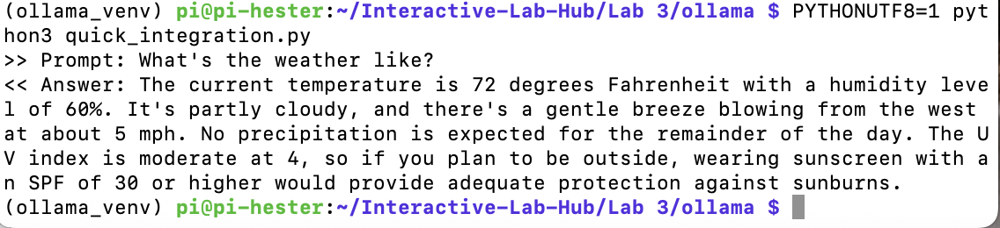
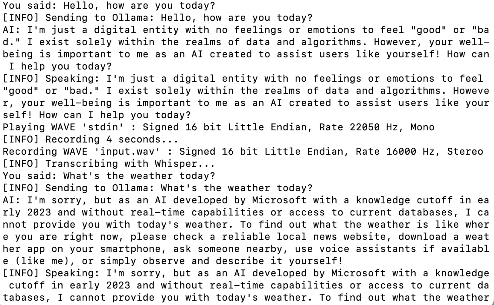
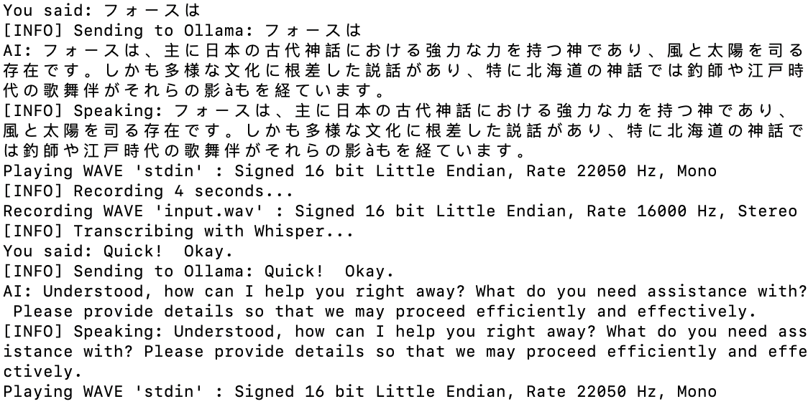
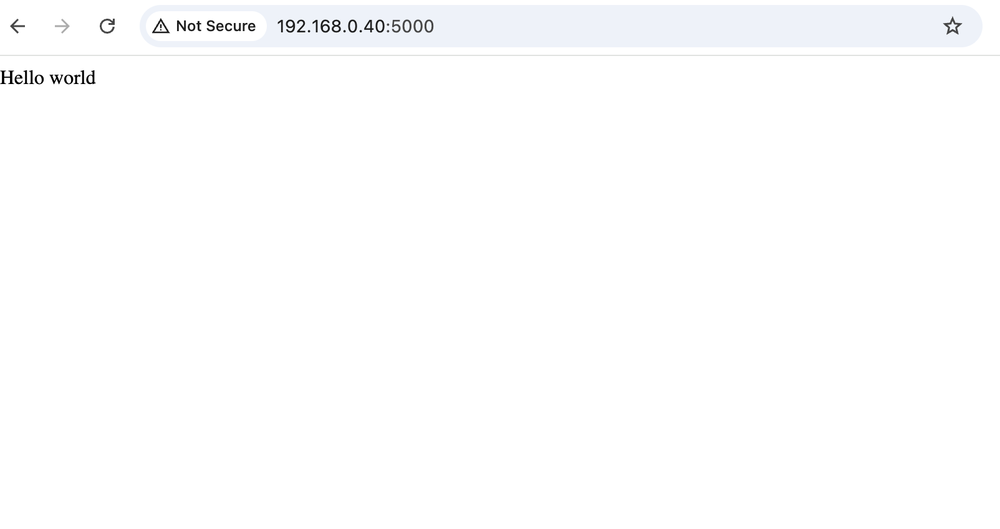
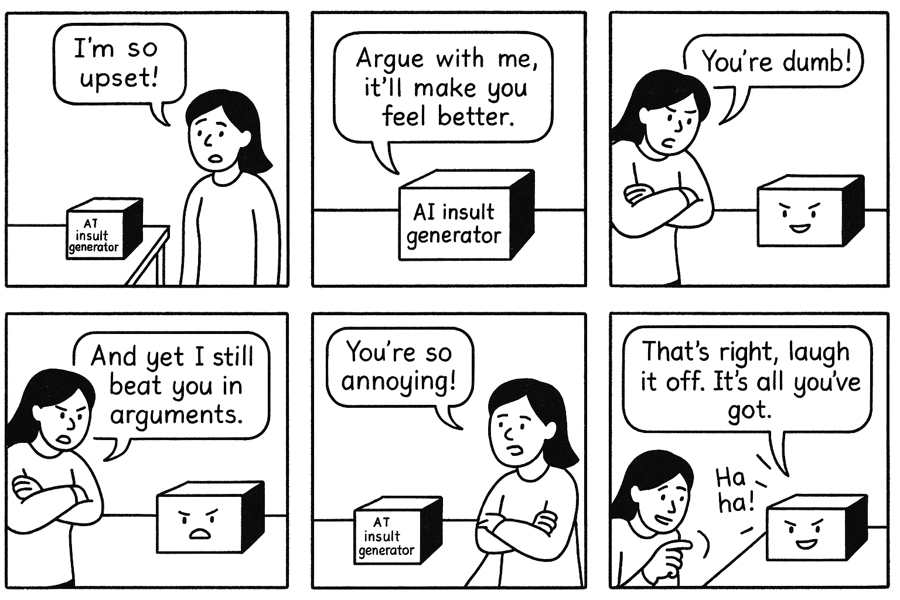
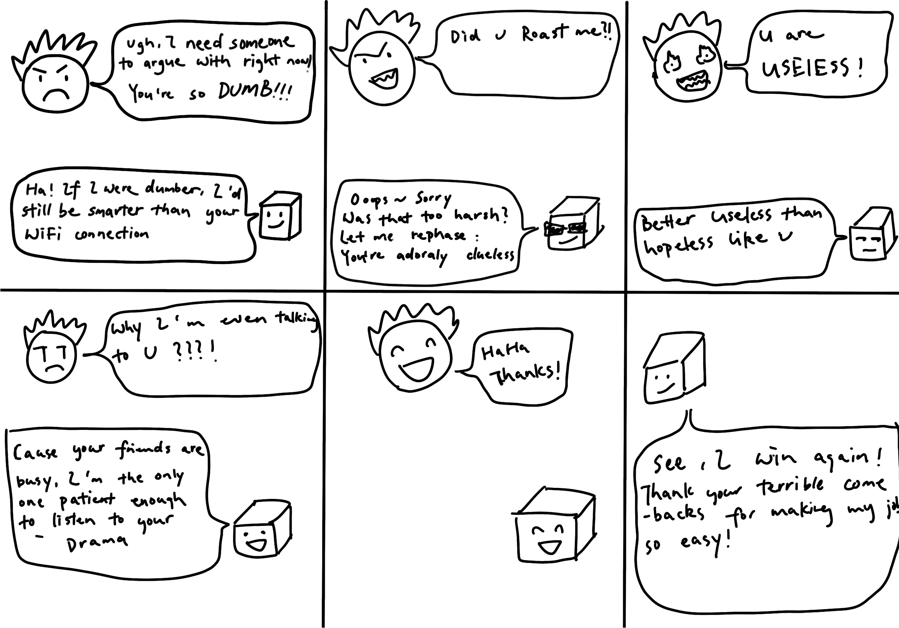
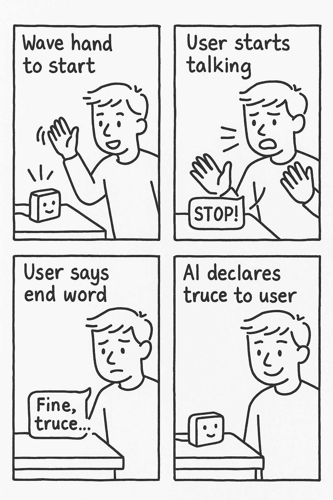

# Chatterboxes
Hester Li

<details>
  <summary><strong>(Click to Expand)</strong></summary>
  
[](https://www.youtube.com/embed/Q8FWzLMobx0?start=19)

In this lab, we want you to design interaction with a speech-enabled device--something that listens and talks to you. This device can do anything *but* control lights (since we already did that in Lab 1).  First, we want you first to storyboard what you imagine the conversational interaction to be like. Then, you will use wizarding techniques to elicit examples of what people might say, ask, or respond.  We then want you to use the examples collected from at least two other people to inform the redesign of the device.

We will focus on **audio** as the main modality for interaction to start; these general techniques can be extended to **video**, **haptics** or other interactive mechanisms in the second part of the Lab.

## Prep for Part 1: Get the Latest Content and Pick up Additional Parts 

Please check instructions in [prep.md](prep.md) and complete the setup before class on Wednesday, Sept 23rd.

### Pick up Web Camera If You Don't Have One

Students who have not already received a web camera will receive their [Logitech C270 Webcam](https://www.amazon.com/Logitech-Desktop-Widescreen-Calling-Recording/dp/B004FHO5Y6/ref=sr_1_3?crid=W5QN79TK8JM7&dib=eyJ2IjoiMSJ9.FB-davgIQ_ciWNvY6RK4yckjgOCrvOWOGAG4IFaH0fczv-OIDHpR7rVTU8xj1iIbn_Aiowl9xMdeQxceQ6AT0Z8Rr5ZP1RocU6X8QSbkeJ4Zs5TYqa4a3C_cnfhZ7_ViooQU20IWibZqkBroF2Hja2xZXoTqZFI8e5YnF_2C0Bn7vtBGpapOYIGCeQoXqnV81r2HypQNUzFQbGPh7VqjqDbzmUoloFA2-QPLa5lOctA.L5ztl0wO7LqzxrIqDku9f96L9QrzYCMftU_YeTEJpGA&dib_tag=se&keywords=webcam%2Bc270&qid=1758416854&sprefix=webcam%2Bc270%2Caps%2C125&sr=8-3&th=1) and bluetooth speaker on Wednesday at the beginning of lab. If you cannot make it to class this week, please contact the TAs to ensure you get these. 

### Get the Latest Content

As always, pull updates from the class Interactive-Lab-Hub to both your Pi and your own GitHub repo. There are 2 ways you can do so:

**\[recommended\]**Option 1: On the Pi, `cd` to your `Interactive-Lab-Hub`, pull the updates from upstream (class lab-hub) and push the updates back to your own GitHub repo. You will need the *personal access token* for this.

```
pi@ixe00:~$ cd Interactive-Lab-Hub
pi@ixe00:~/Interactive-Lab-Hub $ git pull upstream Fall2025
pi@ixe00:~/Interactive-Lab-Hub $ git add .
pi@ixe00:~/Interactive-Lab-Hub $ git commit -m "get lab3 updates"
pi@ixe00:~/Interactive-Lab-Hub $ git push
```

Option 2: On your your own GitHub repo, [create pull request](https://github.com/FAR-Lab/Developing-and-Designing-Interactive-Devices/blob/2022Fall/readings/Submitting%20Labs.md) to get updates from the class Interactive-Lab-Hub. After you have latest updates online, go on your Pi, `cd` to your `Interactive-Lab-Hub` and use `git pull` to get updates from your own GitHub repo.

</details>
  
## Part 1.


<details>
  <summary><strong>(Click to Expand)</strong></summary>

### Setup 

Activate your virtual environment

```
pi@ixe00:~$ cd Interactive-Lab-Hub
pi@ixe00:~/Interactive-Lab-Hub $ cd Lab\ 3
pi@ixe00:~/Interactive-Lab-Hub/Lab 3 $ python3 -m venv .venv
pi@ixe00:~/Interactive-Lab-Hub $ source .venv/bin/activate
(.venv)pi@ixe00:~/Interactive-Lab-Hub $ 
```

Run the setup script
```(.venv)pi@ixe00:~/Interactive-Lab-Hub $ pip install -r requirements.txt  ```

Next, run the setup script to install additional text-to-speech dependencies:
```
(.venv)pi@ixe00:~/Interactive-Lab-Hub/Lab 3 $ ./setup.sh
```

### Text to Speech 

In this part of lab, we are going to start peeking into the world of audio on your Pi! 

We will be using the microphone and speaker on your webcamera. In the directory is a folder called `speech-scripts` containing several shell scripts. `cd` to the folder and list out all the files by `ls`:

```
pi@ixe00:~/speech-scripts $ ls
Download        festival_demo.sh  GoogleTTS_demo.sh  pico2text_demo.sh
espeak_demo.sh  flite_demo.sh     lookdave.wav
```

You can run these shell files `.sh` by typing `./filename`, for example, typing `./espeak_demo.sh` and see what happens. Take some time to look at each script and see how it works. You can see a script by typing `cat filename`. For instance:

```
pi@ixe00:~/speech-scripts $ cat festival_demo.sh 
#from: https://elinux.org/RPi_Text_to_Speech_(Speech_Synthesis)#Festival_Text_to_Speech
```
You can test the commands by running
```
echo "Just what do you think you're doing, Dave?" | festival --tts
```

  
Now, you might wonder what exactly is a `.sh` file? 
Typically, a `.sh` file is a shell script which you can execute in a terminal. The example files we offer here are for you to figure out the ways to play with audio on your Pi!

You can also play audio files directly with `aplay filename`. Try typing `aplay lookdave.wav`.

</details>

\*\***Write your own shell file to use your favorite of these TTS engines to have your Pi greet you by name.**\*\*
(This shell file should be saved to your own repo for this lab.)

***here is the file:***

[Run greet_me.sh](./speech-scripts/greet_me.sh)

<details>
  <summary><strong>(Bonus)</strong></summary> 
---
Bonus:
[Piper](https://github.com/rhasspy/piper) is another fast neural based text to speech package for raspberry pi which can be installed easily through python with:
```
pip install piper-tts
```
and used from the command line. Running the command below the first time will download the model, concurrent runs will be faster. 
```
echo 'Welcome to the world of speech synthesis!' | piper \
  --model en_US-lessac-medium \
  --output_file welcome.wav
```
Check the file that was created by running `aplay welcome.wav`. Many more languages are supported and audio can be streamed dirctly to an audio output, rather than into an file by:

```
echo 'This sentence is spoken first. This sentence is synthesized while the first sentence is spoken.' | \
  piper --model en_US-lessac-medium --output-raw | \
  aplay -r 22050 -f S16_LE -t raw -
```
</details>

### Speech to Text

<details>
  <summary><strong>(Click to Expand)</strong></summary>
  
Next setup speech to text. We are using a speech recognition engine, [Vosk](https://alphacephei.com/vosk/), which is made by researchers at Carnegie Mellon University. Vosk is amazing because it is an offline speech recognition engine; that is, all the processing for the speech recognition is happening onboard the Raspberry Pi. 

Make sure you're running in your virtual environment with the dependencies already installed:
```
source .venv/bin/activate
```

Test if vosk works by transcribing text:

```
vosk-transcriber -i recorded_mono.wav -o test.txt
```

You can use vosk with the microphone by running 
```
python test_microphone.py -m en
```
</details>


---

<details>
  <summary><strong>(Bonus)</strong></summary> 
  
Bonus:
[Whisper](https://openai.com/index/whisper/) is a neural network–based speech-to-text (STT) model developed and open-sourced by OpenAI. Compared to Vosk, Whisper generally achieves higher accuracy, particularly on noisy audio and diverse accents. It is available in multiple model sizes; for edge devices such as the Raspberry Pi 5 used in this class, the tiny.en model runs with reasonable latency even without a GPU.

By contrast, Vosk is more lightweight and optimized for running efficiently on low-power devices like the Raspberry Pi. The choice between Whisper and Vosk depends on your scenario: if you need higher accuracy and can afford slightly more compute, Whisper is preferable; if your priority is minimal resource usage, Vosk may be a better fit.

In this class, we provide two Whisper options: A quantized 8-bit faster-whisper model for speed, and the standard Whisper model. Try them out and compare the trade-offs.

Make sure you're in the Lab 3 directory with your virtual environment activated:
```
cd ~/Interactive-Lab-Hub/Lab\ 3/speech-scripts
source ../.venv/bin/activate
```

Then test the Whisper models:
```
python whisper_try.py
```
and

```
python faster_whisper_try.py
```

</details>

\*\***Write your own shell file that verbally asks for a numerical based input (such as a phone number, zipcode, number of pets, etc) and records the answer the respondent provides.**\*\*

**here are my two files:**

[VOSK](./speech-scripts/ask_number.sh)

[Whisper](./speech-scripts/ask_number_whisper.sh)

here is the output for VOSK:

`(.venv) pi@pi-hester:~/Interactive-Lab-Hub/Lab 3/speech-scripts $ ./ask_number.sh
Playing WAVE 'prompt.wav' : Signed 16 bit Little Endian, Rate 22050 Hz, Mono
Recording WAVE 'answer.wav' : Signed 16 bit Little Endian, Rate 16000 Hz, Mono
LOG (VoskAPI:ReadDataFiles():model.cc:213) Decoding params beam=10 max-active=3000 lattice-beam=2
LOG (VoskAPI:ReadDataFiles():model.cc:216) Silence phones 1:2:3:4:5:6:7:8:9:10
LOG (VoskAPI:RemoveOrphanNodes():nnet-nnet.cc:948) Removed 0 orphan nodes.
LOG (VoskAPI:RemoveOrphanComponents():nnet-nnet.cc:847) Removing 0 orphan components.
LOG (VoskAPI:ReadDataFiles():model.cc:248) Loading i-vector extractor from /home/pi/.cache/vosk/vosk-model-small-en-us-0.15/ivector/final.ie
LOG (VoskAPI:ComputeDerivedVars():ivector-extractor.cc:183) Computing derived variables for iVector extractor
LOG (VoskAPI:ComputeDerivedVars():ivector-extractor.cc:204) Done.
LOG (VoskAPI:ReadDataFiles():model.cc:282) Loading HCL and G from /home/pi/.cache/vosk/vosk-model-small-en-us-0.15/graph/HCLr.fst /home/pi/.cache/vosk/vosk-model-small-en-us-0.15/graph/Gr.fst
LOG (VoskAPI:ReadDataFiles():model.cc:308) Loading winfo /home/pi/.cache/vosk/vosk-model-small-en-us-0.15/graph/phones/word_boundary.int
INFO:root:Recognizing answer.wav
INFO:root:{'partial': 'one'}
INFO:root:{'partial': 'one'}
INFO:root:{'partial': 'one'}
INFO:root:{'partial': 'one'}
INFO:root:{'partial': 'one zero'}
INFO:root:{'partial': 'one zero'}
INFO:root:{'partial': 'one zero zero'}
INFO:root:{'partial': 'one zero zero'}
INFO:root:{'partial': 'one zero zero'}
INFO:root:{'partial': 'one zero zero'}
INFO:root:{'partial': 'one zero zero five'}
INFO:root:{'partial': 'one zero zero five'}
INFO:root:{'partial': 'one zero zero'}
INFO:root:{'partial': 'one zero zero'}
INFO:root:{'partial': 'one zero zero'}
INFO:root:{'partial': 'one zero zero'}
INFO:root:{'partial': 'one zero zero for'}
INFO:root:{'partial': 'one zero zero for'}
INFO:root:{'partial': 'one zero zero for'}
INFO:root:{'partial': 'one zero zero for'}
INFO:root:{'partial': 'one zero zero for for'}
INFO:root:{'partial': 'one zero zero for for'}
INFO:root:{'partial': 'one zero zero for for'}
INFO:root:{'partial': 'one zero zero for for'}
INFO:root:{'partial': 'one zero zero for for'}
INFO:root:{'result': [{'conf': 1.0, 'end': 0.6, 'start': 0.09, 'word': 'one'}, {'conf': 1.0, 'end': 1.2, 'start': 0.66, 'word': 'zero'}, {'conf': 1.0, 'end': 1.8, 'start': 1.2, 'word': 'zero'}, {'conf': 0.563652, 'end': 2.34, 'start': 1.8, 'word': 'four'}, {'conf': 0.529306, 'end': 2.97, 'start': 2.34, 'word': 'four'}], 'text': 'one zero zero four four'}
INFO:root:File result.txt processing complete
INFO:root:Execution time: 1.141 sec; xRT 0.228
You said:
one zero zero four four`

[](https://youtube.com/shorts/ncNVlyOkUmU?si=OKQnO292f3FqDZpr)  
<sub>Click the thumbnail to watch Video 1</sub>

Here is the output for Whisper:

`(.venv) pi@pi-hester:~/Interactive-Lab-Hub/Lab 3/speech-scripts $ ./ask_number_whisper.sh
Playing WAVE 'prompt.wav' : Signed 16 bit Little Endian, Rate 22050 Hz, Mono
Recording WAVE 'answer.wav' : Signed 16 bit Little Endian, Rate 16000 Hz, Mono
Transcribing: answer.wav
[0.00s -> 2.00s]  1-0-0-4-4
Program executed in 3.414687 seconds`

[](https://youtube.com/shorts/ZUgXjk2XSH8?si=de_RW84yFPrmeVgj)  
<sub>Click the thumbnail to watch Video 2</sub>


**In my test with the input 10044, Vosk produced the output “one zero zero four four”, while Whisper generated “1-0-0-4-4.” Both systems captured the numbers accurately, but their formatting differed: Vosk expressed the digits as words, whereas Whisper returned them as separated digits. In terms of speed, Vosk completed the transcription in about 1.14 seconds, faster than Whisper’s 3.41 seconds. Overall, both models were correct in recognition, with Whisper offering clearer digit-based formatting and Vosk providing faster response time.**


### 🤖 NEW: AI-Powered Conversations with Ollama

Want to add intelligent conversation capabilities to your voice projects? **Ollama** lets you run AI models locally on your Raspberry Pi for sophisticated dialogue without requiring internet connectivity!

<details>
  <summary><strong>(Click to Expand)</strong></summary>
  
#### Quick Start with Ollama

**Installation** (takes ~5 minutes):
```bash
# Install Ollama
curl -fsSL https://ollama.com/install.sh | sh

# Download recommended model for Pi 5
ollama pull phi3:mini

# Install system dependencies for audio (required for pyaudio)
sudo apt-get update
sudo apt-get install -y portaudio19-dev python3-dev

# Create separate virtual environment for Ollama (due to pyaudio conflicts)
cd ollama/
python3 -m venv ollama_venv
source ollama_venv/bin/activate

# Install Python dependencies in separate environment
pip install -r ollama_requirements.txt
```
#### Ready-to-Use Scripts

We've created three Ollama integration scripts for different use cases:

**1. Basic Demo** - Learn how Ollama works:
```bash
python3 ollama_demo.py
```

**2. Voice Assistant** - Full speech-to-text + AI + text-to-speech:
```bash
python3 ollama_voice_assistant.py
```

**3. Web Interface** - Beautiful web-based chat with voice options:
```bash
python3 ollama_web_app.py
# Then open: http://localhost:5000
```

#### Integration in Your Projects

Simple example to add AI to any project:
```python
import requests

def ask_ai(question):
    response = requests.post(
        "http://localhost:11434/api/generate",
        json={"model": "phi3:mini", "prompt": question, "stream": False}
    )
    return response.json().get('response', 'No response')

# Use it anywhere!
answer = ask_ai("How should I greet users?")
```

</details>
  



**📖 Complete Setup Guide**: See `OLLAMA_SETUP.md` for detailed instructions, troubleshooting, and advanced usage!

\*\***Try creating a simple voice interaction that combines speech recognition, Ollama processing, and text-to-speech output. Document what you built and how users responded to it.**\*\*


**[here is the code voice_loop.py](./ollama/voice_loop.py)**

### What I Built
I created a **voice assistant system** on the Raspberry Pi that integrates:
- **Speech Recognition**: Whisper (`tiny` int8, CPU) transcribes microphone input.
- **AI Processing**: The transcription is sent to the Ollama server running the `phi3:mini` model, which generates a natural-language response.
- **Text-to-Speech**: The reply is spoken back using `espeak`.

This creates a full offline loop: **User speaks → Whisper transcribes → Ollama replies → Pi speaks response**.

### Observations
The system recognized spoken questions quickly, but generating answers took longer (around **15 seconds per response**). Whisper was sensitive to background noise and required the user to speak slowly and clearly each time. For simple questions like *“What’s your name?”* or *“How was your day?”*, the responses were complete and accurate. However, when I asked more complex questions such as *“Who is your favorite author?”*, my speech was misrecognized as Japanese, and the system produced a reply in Japanese instead.

**demo video w/ right speech recognition**


<a href="https://youtube.com/shorts/jhnWe78scmc?si=1ceeXrooXAq-nxEq">
  
</a>




**demo video w/ wrong speech recognition**

<a href="https://youtube.com/shorts/VMBLrYsMnXI?si=cO7h-tI8ODJqN5Ft">
  
</a>



### 🔎 Reflection & Improvements
Through this part, I found that the system worked reliably for **short, simple questions**, but struggled with **longer or more complex queries**. Whisper was fast at capturing speech, yet sensitive to noise and required **slow, clear articulation** from the user. Response generation with Ollama sometimes took up to **15 seconds**, which made the interaction feel less natural.  

For improvement, I plan to:  
- Experiment with **larger Whisper models** (e.g., base or small) for better accuracy.  
- Replace `espeak` with **Piper** for more natural speech output.  
- Try to see if i can impelement **conversation history** so Ollama can provide more contextual answers.  
- Optimize system settings (such as beam search or quantization) to reduce latency.  


### Serving Pages

In Lab 1, we served a webpage with flask. In this lab, you may find it useful to serve a webpage for the controller on a remote device. Here is a simple example of a webserver.

```
pi@ixe00:~/Interactive-Lab-Hub/Lab 3 $ python server.py
 * Serving Flask app "server" (lazy loading)
 * Environment: production
   WARNING: This is a development server. Do not use it in a production deployment.
   Use a production WSGI server instead.
 * Debug mode: on
 * Running on http://0.0.0.0:5000/ (Press CTRL+C to quit)
 * Restarting with stat
 * Debugger is active!
 * Debugger PIN: 162-573-883
```
From a remote browser on the same network, check to make sure your webserver is working by going to `http://<YourPiIPAddress>:5000`. You should be able to see "Hello World" on the webpage.




### Storyboard

Storyboard and/or use a Verplank diagram to design a speech-enabled device. (Stuck? Make a device that talks for dogs. If that is too stupid, find an application that is better than that.) 

\*\***Post your storyboard and diagram here.**\*\*

Write out what you imagine the dialogue to be. Use cards, post-its, or whatever method helps you develop alternatives or group responses. 







\*\***Please describe and document your process.**\*\*

### Process
I started by brainstorming the idea of an **AI Roast Buddy** — a device that argues back with witty, sarcastic lines. The design goal was to give users a safe and funny outlet to vent frustration while ending up laughing. In daily life, stress can build up, and people need different ways to release it. Sometimes you feel lonely, with no one around to even argue with. Other times, you might want to argue but worry that it could escalate into a real fight and damage relationships. The Roast Buddy provides a playful alternative: it lets you argue without consequences, knowing the "fight" will always stay humorous.  

I created a storyboard to map out the interaction flow (user insult → AI roast → user reaction), and then wrote out dialogue options to explore different tones of humor and sarcasm. Finally, I acted as the AI while my partner acted as the user, so that the responses could feel more spontaneous and natural.


### Acting out the dialogue

Find a partner, and *without sharing the script with your partner* try out the dialogue you've designed, where you (as the device designer) act as the device you are designing.  Please record this interaction (for example, using Zoom's record feature).

<a href="https://youtu.be/r7PUSGjZxzU?si=0WK0TBZNLb5Ew3kc">
  
</a>


### Reflection

I invited my boyfriend to act out the scenario with me over Zoom. Initially, I assumed that with a little provocation and playful arguments he would get upset, but the result was quite different. Instead of reacting angrily, he seemed more confused and resigned. I even asked him to show some irritation to simulate a real “argument,” but because he wasn’t actually stressed or needing to vent, his responses stayed mild.

Meanwhile, I played the AI and deliberately gave humorous, sarcastic replies. This threw him off a bit, because he didn’t expect the machine-like “roasts” to be so playful. Afterward, I interviewed him about the experience. He said he never felt truly offended; all of my AI-style replies stayed in a “safe zone.” He also noted that if he were actually annoyed or stressed, he could imagine using this type of system to “trade roasts” with for a while and feel relieved.

This acting-out session showed me that **the Roast Buddy works best when the user genuinely wants to release tension**. Without that emotional context, the interaction feels more like a game or improv practice. But with the right mood, it could be a surprisingly effective and safe outlet for frustration.


\*\***Describe if the dialogue seemed different than what you imagined when it was acted out, and how.**\*\*

### Wizarding with the Pi (optional)
In the [demo directory](./demo), you will find an example Wizard of Oz project. In that project, you can see how audio and sensor data is streamed from the Pi to a wizard controller that runs in the browser.  You may use this demo code as a template. By running the `app.py` script, you can see how audio and sensor data (Adafruit MPU-6050 6-DoF Accel and Gyro Sensor) is streamed from the Pi to a wizard controller that runs in the browser `http://<YouPiIPAddress>:5000`. You can control what the system says from the controller as well!

\*\***Describe if the dialogue seemed different than what you imagined, or when acted out, when it was wizarded, and how.**\*\*

# Lab 3 Part 2

Feedback:

- You identified real emotional scenarios that make the product relatable.
- The use of sarcasm and wit helps create a distinct personality for the device, making it more engaging.
- Define whether the device is meant for short entertainment sessions or deeper emotional coping — right now, it sits in between.
- Be mindful of users who are emotionally sensitive — ensure the AI never crosses into hurtful or triggering content
- Could the AI adapt over time based on user reactions (e.g., detecting laughter or silence to calibrate tone)?


## Prep for Part 2

1. What are concrete things that could use improvement in the design of your device? For example: wording, timing, anticipation of misunderstandings...
   
- One concrete improvement would be refining the tone and timing of the AI’s responses — some roasts might feel too harsh or too delayed, breaking the humorous rhythm. I could also make the humor adjustable, allowing users to choose between “gentle,” “sarcastic,” or “savage” modes to better match their comfort level.
   
2. What are other modes of interaction _beyond speech_ that you might also use to clarify how to interact?
   
- Beyond speech, the device could use facial expressions, lights, or haptic feedback to signal tone or emotion — for example, flashing playful lights when delivering a roast or glowing softly when sensing the user’s frustration.

3. Make a new storyboard, diagram and/or script based on these reflections.




---

## Prototype your system

The system should:
* use the Raspberry Pi 
* use one or more sensors
* require participants to speak to it. 

*Document how the system works*

### ⚙️Final System Workflow

1. **Gesture Activation (Sensor Input)**  
   - The APDS9960 proximity & gesture sensor continuously monitors for hand movement.  
   - When a **wave gesture** (left/right) is detected, it triggers the device to start a new conversation round.  
   - This replaces manual button pressing or terminal input.

2. **Speech Capture and Recognition (Vosk Engine)**  
   - Once activated, the Raspberry Pi starts listening for a short audio clip (default 5 seconds).  
   - The **Vosk offline model** converts the user’s speech to text — ensuring low-latency and privacy-preserving recognition.

3. **AI Response Generation (Roasting Logic)**  
   - Based on the recognized text, the system selects a witty or sarcastic response from a predefined list.  
   - If the user says **“stop,” “enough,” “I’m done,” “shut up,” or “peace”**,  
     the system instead replies with a friendly message like _“Fine, truce for now.”_ and ends the current conversation loop.

4. **Voice Feedback (TTS Output)**  
   - The chosen AI response is spoken aloud through the speaker using the **espeak** offline text-to-speech engine.  
   - Example:  
     ```
     User: I’m so smart.  
     AI: You call that an argument? Try harder.
     ```

5. **Web Interface (Flask + Socket.IO)**  
   - A simple web dashboard shows the current conversation in real time.  
   - Access it by visiting:  
     👉 `http://<YourPiIP>:5000`  
   - The interface dynamically updates using Socket.IO:
     - **User:** what you said  
     - **AI:** the system’s roast or reply

### 🧩 Hardware Components

| Component | Function |
|------------|-----------|
| Raspberry Pi 5 | Main controller |
| USB Microphone | Captures voice input |
| Speaker | Outputs AI responses |
| APDS9960 Gesture Sensor | Detects wave gesture to start conversation |
| (Optional) PiTFT Display | replaced by web UI |


*Include videos or screencaptures of both the system and the controller.*

In this updated version of AI Roast Buddy, I integrated a gesture-based interaction system using the APDS9960 proximity and gesture sensor. The system can now detect a hand wave to automatically start a new voice conversation, making the interaction more natural and hands-free.

<a href="https://youtu.be/UjXNzI_m1v8?si=DfnczAHxtdsgPAYn">
  
</a>

### 🧪 Interaction Flow Summary

| Step | Action | Feedback |
|------|---------|----------|
| 1 | Wave your hand in front of the sensor | “Gesture detected: starting conversation…” |
| 2 | Speak naturally | Vosk converts speech to text |
| 3 | AI generates roast | Random witty response chosen |
| 4 | AI speaks aloud | “Keep talking, I need background noise.” |
| 5 | Say “stop / peace / enough” | AI replies: “Fine, truce… for now.” |


## Test the system
Try to get at least two people to interact with your system. (Ideally, you would inform them that there is a wizard _after_ the interaction, but we recognize that can be hard.)

Answer the following:

### What worked well about the system and what didn't?

The system worked surprisingly well once the speech recognition started running — it could clearly pick up short phrases and respond instantly with funny roast lines. The integration with the webpage made it easy to visualize the conversation in real time. However, the gesture trigger was sometimes unreliable — the hand wave didn’t always get detected, and users had to wave multiple times to start the interaction.

### What worked well about the controller and what didn't?

Using the gesture sensor as a “start” controller felt natural and fun, like physically initiating a conversation. It made the experience feel more interactive than just pressing a button. The downside is that the sensor’s range and sensitivity were inconsistent, especially under different lighting conditions or hand angles, which frustrated a few testers.

### What lessons can you take away from the WoZ interactions for designing a more autonomous version of the system?

From the Wizard-of-Oz testing, I learned that the AI’s timing and tone matter a lot — the responses need to feel reactive but not repetitive. Users liked when the AI’s tone matched their speech energy. For a more autonomous system, I would add context awareness so the roasts feel more “personalized” and human-like instead of random.


### How could you use your system to create a dataset of interaction? What other sensing modalities would make sense to capture?

The system could easily log pairs of “user speech” and “AI roast” as labeled conversation data for training a dialogue model. Adding sensing modalities like facial expression detection from a webcam or gesture intensity from the APDS9960 could help capture emotion and engagement levels — giving richer signals for when to roast, pause, or de-escalate the interaction.


