# Ph-UI!!!

<details>
	<summary><strong>Instructions for Students (Click to Expand)</strong></summary>
  
	**Submission Cleanup Reminder:**
	- This README.md contains extra instructional text for guidance.
	- Before submitting, remove all instructional text and example prompts from this file.
	- You may delete these sections or use the toggle/hide feature in VS Code to collapse them for a cleaner look.
	- Your final submission should be neat, focused on your own work, and easy to read for grading.
  
	This helps ensure your README.md is clear, professional, and uniquely yours!
</details>

---

## Lab 4 Deliverables

### Part 1 (Week 1)
**Submit the following for Part 1:**  
*️⃣ **A. Capacitive Sensing**
	- Photos/videos of your Twizzler (or other object) capacitive sensor setup
	- Code and terminal output showing touch detection

*️⃣ **B. More Sensors**
	- Photos/videos of each sensor tested (light/proximity, rotary encoder, joystick, distance sensor)
	- Code and terminal output for each sensor

*️⃣ **C. Physical Sensing Design**
	- 5 sketches of different ways to use your chosen sensor
	- Written reflection: questions raised, what to prototype
	- Pick one design to prototype and explain why

*️⃣ **D. Display & Housing**
	- 5 sketches for display/button/knob positioning
	- Written reflection: questions raised, what to prototype
	- Pick one display design to integrate
	- Rationale for design
	- Photos/videos of your cardboard prototype

---

### Part 2 (Week 2)
**Submit the following for Part 2:**  
*️⃣ **E. Multi-Device Demo**
	- Code and video for your multi-input multi-output demo (e.g., chaining Qwiic buttons, servo, GPIO expander, etc.)
	- Reflection on interaction effects and chaining

*️⃣ **F. Final Documentation**
	- Photos/videos of your final prototype
	- Written summary: what it looks like, works like, acts like
	- Reflection on what you learned and next steps

---

## Lab Overview
**Hester Li**


For lab this week, we focus both on sensing, to bring in new modes of input into your devices, as well as prototyping the physical look and feel of the device. You will think about the physical form the device needs to perform the sensing as well as present the display or feedback about what was sensed. 

## Part 1 Lab Preparation

<details>
	<summary><strong>(Click to Expand)</strong></summary>
  
### Get the latest content:
As always, pull updates from the class Interactive-Lab-Hub to both your Pi and your own GitHub repo. As we discussed in the class, there are 2 ways you can do so:


Option 1: On the Pi, `cd` to your `Interactive-Lab-Hub`, pull the updates from upstream (class lab-hub) and push the updates back to your own GitHub repo. You will need the personal access token for this.
```
pi@ixe00:~$ cd Interactive-Lab-Hub
pi@ixe00:~/Interactive-Lab-Hub $ git pull upstream Fall2025
pi@ixe00:~/Interactive-Lab-Hub $ git add .
pi@ixe00:~/Interactive-Lab-Hub $ git commit -m "get lab4 content"
pi@ixe00:~/Interactive-Lab-Hub $ git push
```

Option 2: On your own GitHub repo, [create pull request](https://github.com/FAR-Lab/Developing-and-Designing-Interactive-Devices/blob/2021Fall/readings/Submitting%20Labs.md) to get updates from the class Interactive-Lab-Hub. After you have latest updates online, go on your Pi, `cd` to your `Interactive-Lab-Hub` and use `git pull` to get updates from your own GitHub repo.

Option 3: (preferred) use the Github.com interface to update the changes.

### Start brainstorming ideas by reading: 

* [What do prototypes prototype?](https://www.semanticscholar.org/paper/What-do-Prototypes-Prototype-Houde-Hill/30bc6125fab9d9b2d5854223aeea7900a218f149)
* [Paper prototyping](https://www.uxpin.com/studio/blog/paper-prototyping-the-practical-beginners-guide/) is used by UX designers to quickly develop interface ideas and run them by people before any programming occurs. 
* [Cardboard prototypes](https://www.youtube.com/watch?v=k_9Q-KDSb9o) help interactive product designers to work through additional issues, like how big something should be, how it could be carried, where it would sit. 
* [Tips to Cut, Fold, Mold and Papier-Mache Cardboard](https://makezine.com/2016/04/21/working-with-cardboard-tips-cut-fold-mold-papier-mache/) from Make Magazine.
* [Surprisingly complicated forms](https://www.pinterest.com/pin/50032245843343100/) can be built with paper, cardstock or cardboard.  The most advanced and challenging prototypes to prototype with paper are [cardboard mechanisms](https://www.pinterest.com/helgangchin/paper-mechanisms/) which move and change. 
* [Dyson Vacuum Cardboard Prototypes](http://media.dyson.com/downloads/JDF/JDF_Prim_poster05.pdf)
<p align="center"> </p>

### Gathering materials for this lab:

* Cardboard (start collecting those shipping boxes!)
* Found objects and materials--like bananas and twigs.
* Cutting board
* Cutting tools
* Markers


(We do offer shared cutting board, cutting tools, and markers on the class cart during the lab, so do not worry if you don't have them!)

## Deliverables \& Submission for Lab 4

The deliverables for this lab are, writings, sketches, photos, and videos that show what your prototype:
* "Looks like": shows how the device should look, feel, sit, weigh, etc.
* "Works like": shows what the device can do.
* "Acts like": shows how a person would interact with the device.

For submission, the readme.md page for this lab should be edited to include the work you have done:
* Upload any materials that explain what you did, into your lab 4 repository, and link them in your lab 4 readme.md.
* Link your Lab 4 readme.md in your main Interactive-Lab-Hub readme.md. 
* Labs are due on Mondays, make sure to submit your Lab 4 readme.md to Canvas.

</details>

## Lab Overview

A) [Capacitive Sensing](#part-a)

B) [OLED screen](#part-b) 

C) [Paper Display](#part-c)

D) [Materiality](#part-d)

E) [Servo Control](#part-e)

F) [Record the interaction](#part-f)


## The Report (Part 1: A-D, Part 2: E-F)

<details>
	<summary><strong>(Click to Expand)</strong></summary>
	
### Quick Start: Python Environment Setup

1. **Create and activate a virtual environment in Lab 4:**
	```bash
	cd ~/Interactive-Lab-Hub/Lab\ 4
	python3 -m venv .venv
	source .venv/bin/activate
	```
2. **Install all Lab 4 requirements:**
	```bash
	pip install -r requirements2025.txt
	```
3. **Check CircuitPython Blinka installation:**
	```bash
	python blinkatest.py
	```
	If you see "Hello blinka!", your setup is correct. If not, follow the troubleshooting steps in the file or ask for help.

</details>


### Part A
### Capacitive Sensing, a.k.a. Human-Twizzler Interaction 

<details>
	<summary><strong>(Click to Expand)</strong></summary>

	
We want to introduce you to the [capacitive sensor](https://learn.adafruit.com/adafruit-mpr121-gator) in your kit. It's one of the most flexible input devices we are able to provide. At boot, it measures the capacitance on each of the 12 contacts. Whenever that capacitance changes, it considers it a user touch. You can attach any conductive material. In your kit, you have copper tape that will work well, but don't limit yourself! In the example below, we use Twizzlers--you should pick your own objects.


<p float="left">

 
</p>

Plug in the capacitive sensor board with the QWIIC connector. Connect your Twizzlers with either the copper tape or the alligator clips (the clips work better). Install the latest requirements from your working virtual environment:

These Twizzlers are connected to pads 6 and 10. When you run the code and touch a Twizzler, the terminal will print out the following

```
(circuitpython) pi@ixe00:~/Interactive-Lab-Hub/Lab 4 $ python cap_test.py 
Twizzler 10 touched!
Twizzler 6 touched!
```
</details>

**setups:**

Since I didn’t have Twizzlers available, I experimented with alternative conductive objects. I connected a metal spoon to pad 6 and a silver ring to pad 10 using alligator clips. Both objects were detected immediately upon touch, and the ring surprisingly responded even faster, possibly due to the smaller surface area making contact more concentrated.

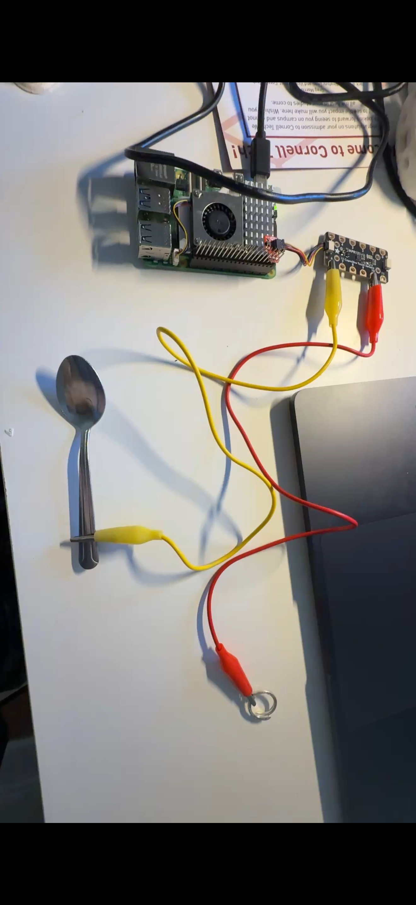

<a href="https://youtube.com/shorts/_7dlhKXxuh8?si=-6HPd2uPL9u-wGYs">
  
</a>

**output:**


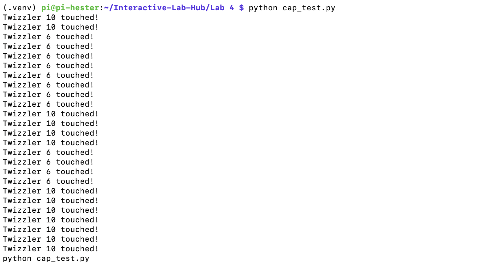

Using unconventional conductive objects like a spoon and a ring made the interaction feel more personal and less like a lab demo. It made me realize that choosing the right material can influence how “alive” or responsive the interface feels, even when the code stays exactly the same.


### Part B
### More sensors

#### Light/Proximity/Gesture sensor (APDS-9960)

<details>
	<summary><strong>(Click to Expand)</strong></summary>
	
We here want you to get to know this awesome sensor [Adafruit APDS-9960](https://www.adafruit.com/product/3595). It is capable of sensing proximity, light (also RGB), and gesture! 
 

 

Connect it to your pi with Qwiic connector and try running the three example scripts individually to see what the sensor is capable of doing!

```
(circuitpython) pi@ixe00:~/Interactive-Lab-Hub/Lab 4 $ python proximity_test.py
...
(circuitpython) pi@ixe00:~/Interactive-Lab-Hub/Lab 4 $ python gesture_test.py
...
(circuitpython) pi@ixe00:~/Interactive-Lab-Hub/Lab 4 $ python color_test.py
...
```

You can go the the [Adafruit GitHub Page](https://github.com/adafruit/Adafruit_CircuitPython_APDS9960) to see more examples for this sensor!

</details>

**proximity_test:**

<a href="https://youtu.be/PDQ4QGDGU5c?si=eQWmitJMrcxUD4yw">
  
</a>

output:


When running proximity_test.py, the sensor started outputting low values like 0 and 1, which seems to be its idle state. Once I moved my hand closer, the numbers began to rise gradually and peaked around 31.

I also noticed that the readings drop back to 0 very quickly once I pull my hand away, meaning the sensor is highly reactive but not smoothed, unlike the SparkFun proximity sensor I tested later that produced large jumps like 3000+. This one feels more binary-like, giving a small range but fast enough to detect motion instead of just distance.

**gesture_test:**

<a href="https://youtube.com/shorts/s2Hibrgg9U8?si=Zle7ZT7yj3JZ0oax">
  
</a>


output:

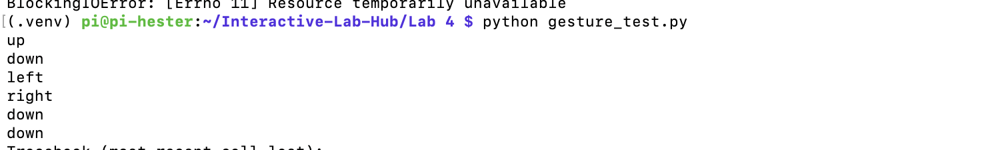

What I noticed during testing is that horizontal gestures (left/right) were picked up more reliably than vertical ones, especially when moving slowly. The down gesture triggered most consistently, which suggests the IR sensor alignment might be slightly more sensitive in that axis. Also, when I repeated the same gesture twice (like down → down), the sensor still registered both events instead of treating it as a single continuous motion, which means it can be used to detect repeated swipes as separate actions rather than just orientation.

**color_test:**

<a href="https://youtube.com/shorts/song3fdmUCc?si=8XHMFZV-sYbGwsFp">
  
</a>

output:

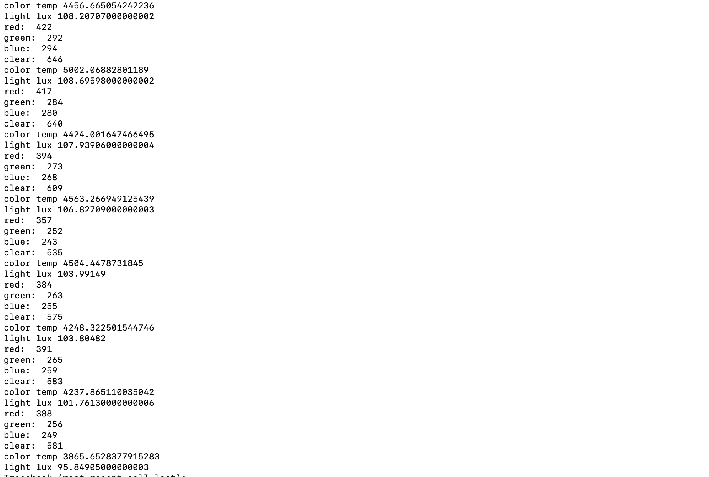

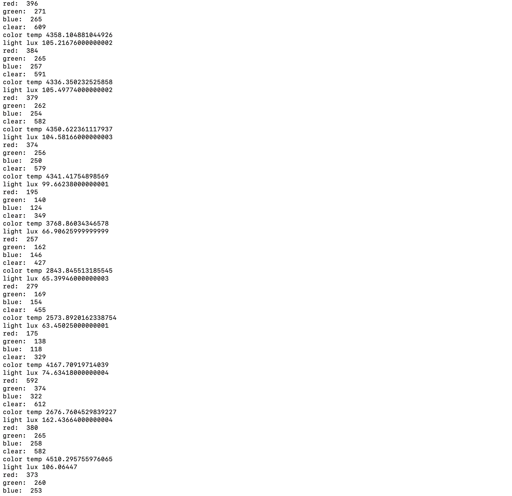

I noticed that the red / green / blue / clear values shifted noticeably each time I swapped the object. For the red bag, the red channel clearly dominated, and the color temperature stayed around 1600–2500, suggesting a warmer reading. When I switched to the green gum wrapper, the green values became more prominent and the color temp increased toward the 4000–4500 range, which felt closer to a "neutral light" reading.

The most interesting part was the yellow tea packaging: even though yellow is a mix of red and green, the readings reflected that both red and green values stayed relatively high, while blue remained lower, which matches how yellow behaves in RGB space. The lux readings also jumped, meaning the reflective yellow surface bounced more light into the sensor.

#### Rotary Encoder 

<details>
	<summary><strong>(Click to Expand)</strong></summary>
	
A rotary encoder is an electro-mechanical device that converts the angular position to analog or digital output signals. The [Adafruit rotary encoder](https://www.adafruit.com/product/4991#technical-details) we ordered for you came with separate breakout board and encoder itself, that is, they will need to be soldered if you have not yet done so! We will be bringing the soldering station to the lab class for you to use, also, you can go to the MakerLAB to do the soldering off-class. Here is some [guidance on soldering](https://learn.adafruit.com/adafruit-guide-excellent-soldering/preparation) from Adafruit. When you first solder, get someone who has done it before (ideally in the MakerLAB environment). It is a good idea to review this material beforehand so you know what to look at.

<p float="left">

   


</p>

Connect it to your pi with Qwiic connector and try running the example script, it comes with an additional button which might be useful for your design!

```
(circuitpython) pi@ixe00:~/Interactive-Lab-Hub/Lab 4 $ python encoder_test.py
```

You can go to the [Adafruit Learn Page](https://learn.adafruit.com/adafruit-i2c-qt-rotary-encoder/python-circuitpython) to learn more about the sensor! The sensor actually comes with an LED (neo pixel): Can you try lighting it up? 

</details>

<a href="https://youtu.be/xo6mFgckvEc?si=bvXn7n_sCs7Swc0y">
  
</a>

**output:**

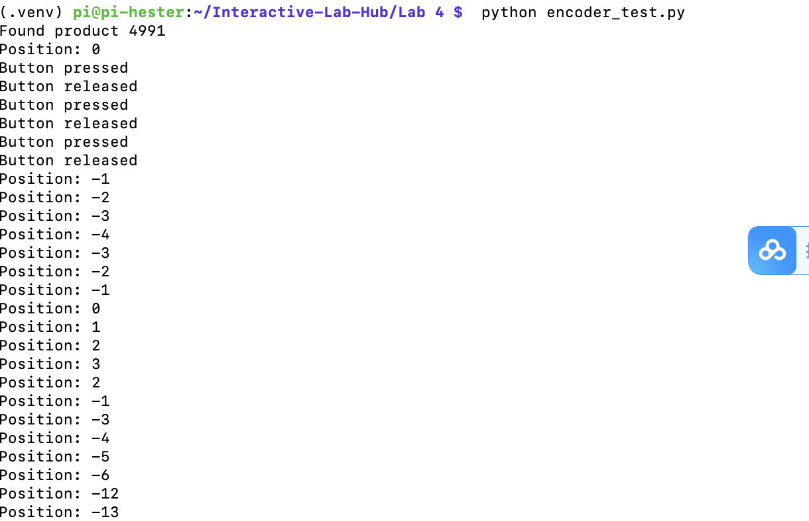

After wiring the rotary encoder, I tested both the rotational output and the push-button input. The serial output showed a smooth count sequence when rotating clockwise and counterclockwise, and I intentionally rotated it quickly at one point, that’s where the reading suddenly jumped from -6 to -12 and -13, which suggests the sensor can register fast consecutive pulses without lag.

The button input also worked reliably. I got a consistent “Button pressed / Button released” pattern every time I clicked it. The mechanical click feedback matched the serial log timing, so I can probably use this as a mode switch or confirm input in later interactions.

#### Joystick 

<details>
	<summary><strong>(Click to Expand)</strong></summary>
	
A [joystick](https://www.sparkfun.com/products/15168) can be used to sense and report the input of the stick for it pivoting angle or direction. It also comes with a button input!

<p float="left">

</p>

Connect it to your pi with Qwiic connector and try running the example script to see what it can do!

```
(circuitpython) pi@ixe00:~/Interactive-Lab-Hub/Lab 4 $ python joystick_test.py
```

You can go to the [SparkFun GitHub Page](https://github.com/sparkfun/Qwiic_Joystick_Py) to learn more about the sensor!


</details>

<a href="https://youtu.be/E5EZj5MNu90?si=6XbK3xTksi8eficf">
  
</a>

**output:**

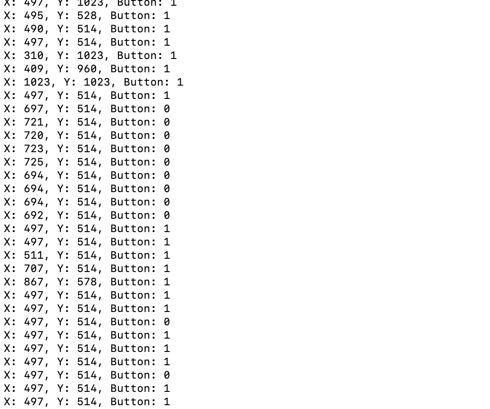

While testing the joystick, I noticed that the button state flips between 1 and 0 depending on press action. When the joystick is released, the log shows Button: 1, and pressing it down switches it to Button: 0, which confirms that the default state is HIGH and becomes LOW when clicked, is useful to remember if I plan to use it as a trigger input.

For directional movement, shifting the stick left/right changes the X value significantly, peaking near 1023 on one side and dropping close to 300–400 on the other. The Y values showed similar jumps when I pushed it vertically. This confirms that the joystick behaves more like an analog continuous input rather than just directional switches, meaning I could map ranges to different interaction modes instead of treating it as binary directions.

#### Distance Sensor

<details>
	<summary><strong>(Click to Expand)</strong></summary>

Earlier we have asked you to play with the proximity sensor, which is able to sense objects within a short distance. Here, we offer [Sparkfun Proximity Sensor Breakout](https://www.sparkfun.com/products/15177), With the ability to detect objects up to 20cm away.

<p float="left">


</p>

Connect it to your pi with Qwiic connector and try running the example script to see how it works!

```
(circuitpython) pi@ixe00:~/Interactive-Lab-Hub/Lab 4 $ python qwiic_distance.py
```

You can go to the [SparkFun GitHub Page](https://github.com/sparkfun/Qwiic_Proximity_Py) to learn more about the sensor and see other examples

</details>

<a href="https://youtu.be/xo6mFgckvEc?si=bvXn7n_sCs7Swc0y">
  
</a>

**output:**


When I first ran the proximity test, the readings stayed low (1–6 range) until I moved my hand closer. As soon as I crossed a certain threshold, the values spiked dramatically.I got jumps like 276 → 360 → 799 → 3910, and at one point it even went above 4000, which confirms that the sensor reacts more to sudden movement than to static distance.

Interestingly, when I held my hand still in front of it, the value didn’t remain stable, it kept oscillating between mid and low values (around 90 → 1432 → 436 → 92 → 1), which makes me think the raw output is slightly noisy and would probably need smoothing or a moving average if I want to use it for a more controlled interaction.


### Part C
### Physical considerations for sensing


Usually, sensors need to be positioned in specific locations or orientations to make them useful for their application. Now that you've tried a bunch of the sensors, pick one that you would like to use, and an application where you use the output of that sensor for an interaction. For example, you can use a distance sensor to measure someone's height if you position it overhead and get them to stand under it.


**\*\*\*Draw 5 sketches of different ways you might use your sensor, and how the larger device needs to be shaped in order to make the sensor useful.\*\*\*** + **\*\*\*What are some things these sketches raise as questions? What do you need to physically prototype to understand how to anwer those questions?\*\*\***


**1. Mood Radio — Emotional Tuning Dial**
   
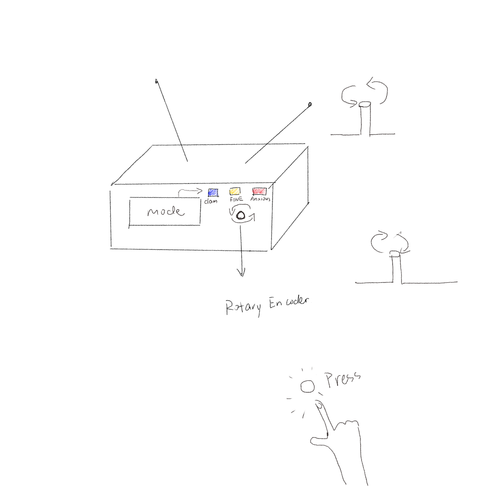

Concept Description:
A rotary encoder is used like a classic FM radio tuner to “tune” between emotional states (Calm → Stressed → Meltdown). LED indicators act like frequency markers that light up as the user rotates through mood levels.

How the larger device needs to be shaped:
The device should resemble a flat radio panel with a clearly visible curved or linear scale above the knob. The circular knob must be centered and ergonomically positioned so the user naturally grips and rotates it like a tuning dial.

**Questions raised & prototype needs:**

How many mood “steps” feel intuitive along the dial?

Should the LED scale arc above the knob or align horizontally like a radio tuner?

Does pressing down after tuning feel like a natural confirmation action?
→ A cardboard mockup is needed to test knob placement, labeling readability, and hand comfort when rotating.

**2. Decision Wheel**
   
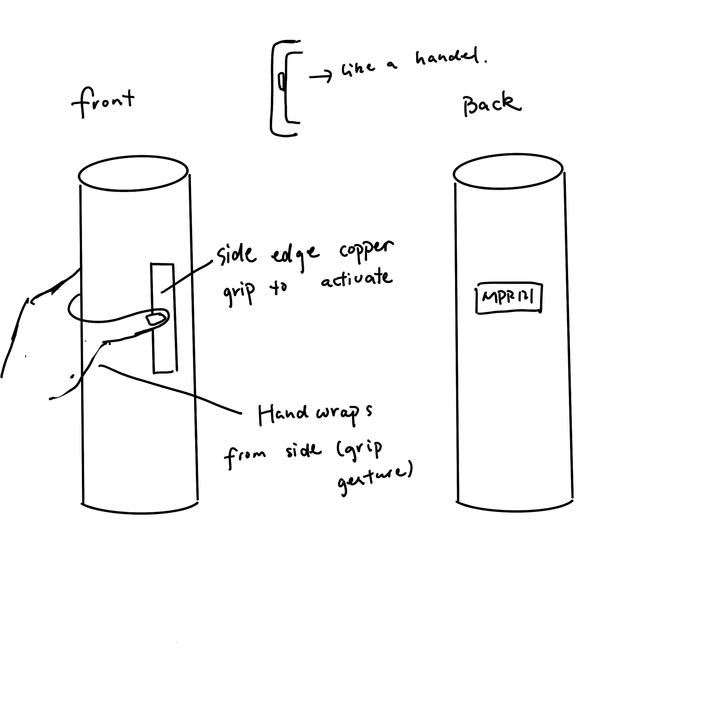

Concept Description:
The rotary encoder simulates a roulette-style choice mechanism, where rotating between YES and NO zones gamifies self-control around snacks. A press confirms the final decision.

How the larger device needs to be shaped:
The physical device should take the form of a circular panel resembling a game wheel or fortune spinner, with clear left/right color-coded zones. The knob sits at the center like a “spin trigger.”

**Questions raised & prototype needs:**

How large should the zones be to make the YES/NO states visually clear?

Does the knob placement in the center feel like a natural “spin” input?

Is pressing down satisfying enough as a "lock-in" action?
→ A simple cardboard wheel with printed or drawn zones can validate visual legibility and gesture intention.

**3.Emotional Detonator — Countdown Stress Dial**

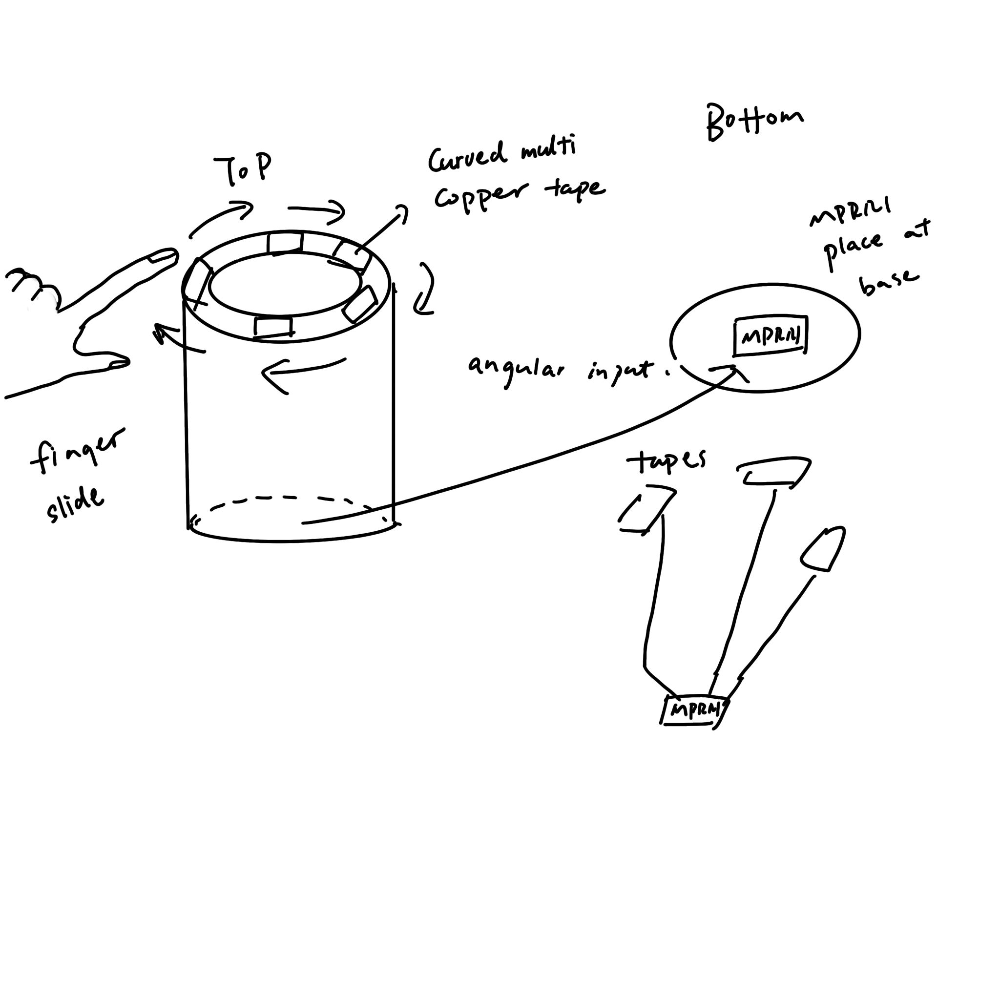

Concept Description:
The encoder acts as an activation trigger for a dramatic “emotional bomb.” Rotating increases countdown intensity (LED segments fill up), while pressing detonates with sound/flash feedback.

How the larger device needs to be shaped:
The device should look like a bomb trigger interface — a rectangular or square board with a row of LED-like markers above the knob. The knob must be placed low and central, mimicking a real detonation dial.

**Questions raised & prototype needs:**

Does a horizontal LED bar above the knob convey “countdown” clearly?

How far should rotation travel before triggering visual excitement or tension?

Is downward press after rotation a natural metaphor for “confirm / detonate”?
→ A paper prototype can help test whether users understand the bomb metaphor through layout alone.

**4. Lazy Clock — Passive-Aggressive Alarm Controller**

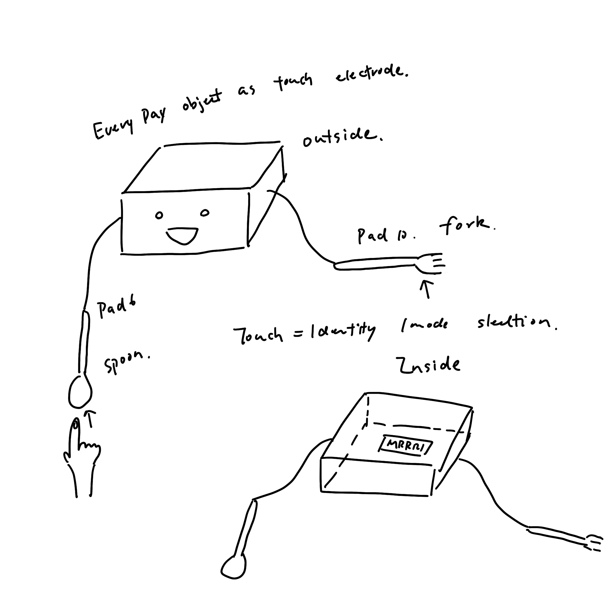

Concept Description:
A satirical alarm clock controller where turning the knob delays or advances the alarm. LEDs show +5 or -5 minutes depending on rotation direction, and pressing confirms with snarky feedback.

How the larger device needs to be shaped:
The housing should mimic the front face of a clock, with the knob placed where traditional alarm-setting knobs are found. LED indicators or arrows should be positioned clearly on left and right sides of the knob.

**Questions raised & prototype needs:**

Will users immediately recognize the clock layout and understand the +/− metaphor?

Should the LED indicators sit near the edges or closer to the knob?

Does pressing after rotation feel like setting a timer, or do users expect an automatic confirmation?
→ A cardboard clock front helps test affordances and gesture expectations connected to conventional alarm devices.

**5. Spin-to-Manifest — Cosmic Wish Dial**

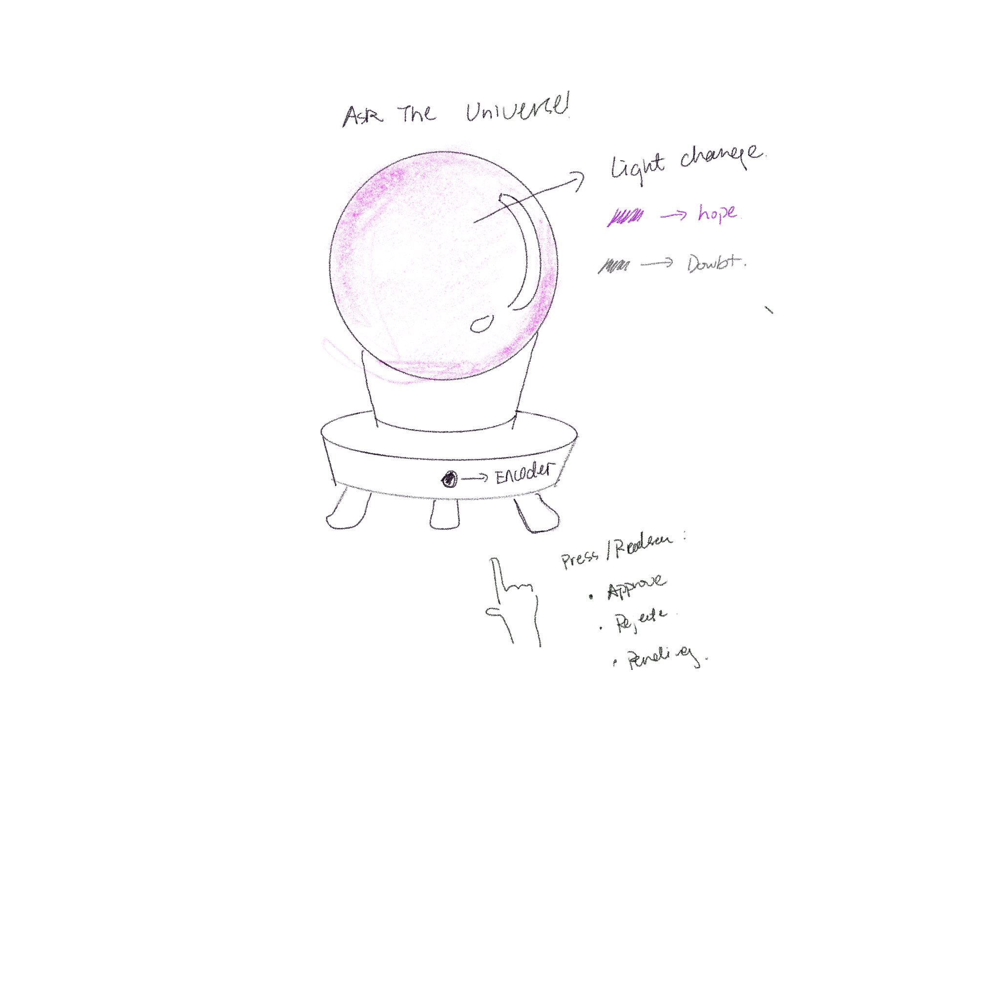

Concept Description:
The encoder becomes a mystical ritual control, where rotating adjusts "faith energy" between HOPE and DOUBT. LEDs show cosmic activation, and pressing sends a final “universe request.”

How the larger device needs to be shaped:
The body should resemble a mystical panel or oracle board, possibly vertical like a shrine or tarot stand. The LED arc must visually indicate energy rising as the knob moves upward (clockwise). The knob should be positioned like a ceremonial activation button.

**Questions raised & prototype needs:**
Should the LED arc be circular above the knob or linear across the top to convey “energy build-up”?

Does the mystical layout successfully communicate that pressing is a final ritual action instead of just a technical input?

Is the metaphor clear enough without text, or do we need visual symbols (stars, arcane icons)?
→ A drawn mockup with cosmic styling can test if the metaphor is readable without explanation and whether the knob feels like a ritual control.

**\*\*\*Pick one of these designs to prototype.\*\*\***

I decided to prototype the Decision Roulette Dial, a rotary-encoder-based device designed to help with everyday indecision. The concept is expanded into a universal decision helper for people with decision paralysis. By rotating the knob between YES and NO (or even multiple decision outcomes), and pressing down to “lock in fate”, the device turns hesitation into a playful ritual.

This design is ideal for prototyping because it requires only one rotary encoder and a cardboard surface, yet it supports clear directional interaction (clockwise vs. counterclockwise) and a meaningful press-to-confirm moment. The circular wheel layout also provides strong visual affordance—the user intuitively understands that rotation represents “thinking” and pressing represents “committing.”

### Part D
### Physical considerations for displaying information and housing parts

<details>
	<summary><strong>(Click to Expand)</strong></summary>

Here is a Pi with a paper faceplate on it to turn it into a display interface:


This is fine, but the mounting of the display constrains the display location and orientation a lot. Also, it really only works for applications where people can come and stand over the Pi, or where you can mount the Pi to the wall.

Here is another prototype for a paper display:


Your kit includes these [SparkFun Qwiic OLED screens](https://www.sparkfun.com/products/17153). These use less power than the MiniTFTs you have mounted on the GPIO pins of the Pi, but, more importantly, they can be more flexibly mounted elsewhere on your physical interface. The way you program this display is almost identical to the way you program a  Pi display. Take a look at `oled_test.py` and some more of the [Adafruit examples](https://github.com/adafruit/Adafruit_CircuitPython_SSD1306/tree/master/examples).

<p float="left">


</p>


It holds a Pi and usb power supply, and provides a front stage on which to put writing, graphics, LEDs, buttons or displays.

This design can be made by scoring a long strip of corrugated cardboard of width X, with the following measurements:

| Y height of box <br> <sub><sup>- thickness of cardboard</sup></sub> | Z  depth of box <br><sub><sup>- thickness of cardboard</sup></sub> | Y height of box  | Z  depth of box | H height of faceplate <br><sub><sup>* * * * * (don't make this too short) * * * * *</sup></sub>|
| --- | --- | --- | --- | --- | 

Fold the first flap of the strip so that it sits flush against the back of the face plate, and tape, velcro or hot glue it in place. This will make a H x X interface, with a box of Z x X footprint (which you can adapt to the things you want to put in the box) and a height Y in the back. 

Here is an example:


Think about how you want to present the information about what your sensor is sensing! Design a paper display for your project that communicates the state of the Pi and a sensor. Ideally you should design it so that you can slide the Pi out to work on the circuit or programming, and then slide it back in and reattach a few wires to be back in operation.

 
</details>


**\*\*\*Sketch 5 designs for how you would physically position your display and any buttons or knobs needed to interact with it.\*\*\***

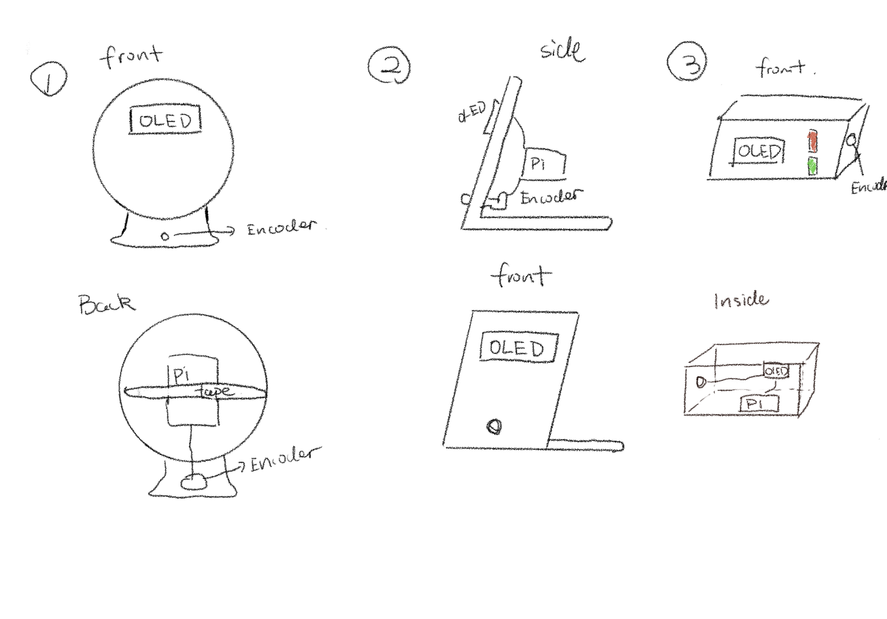
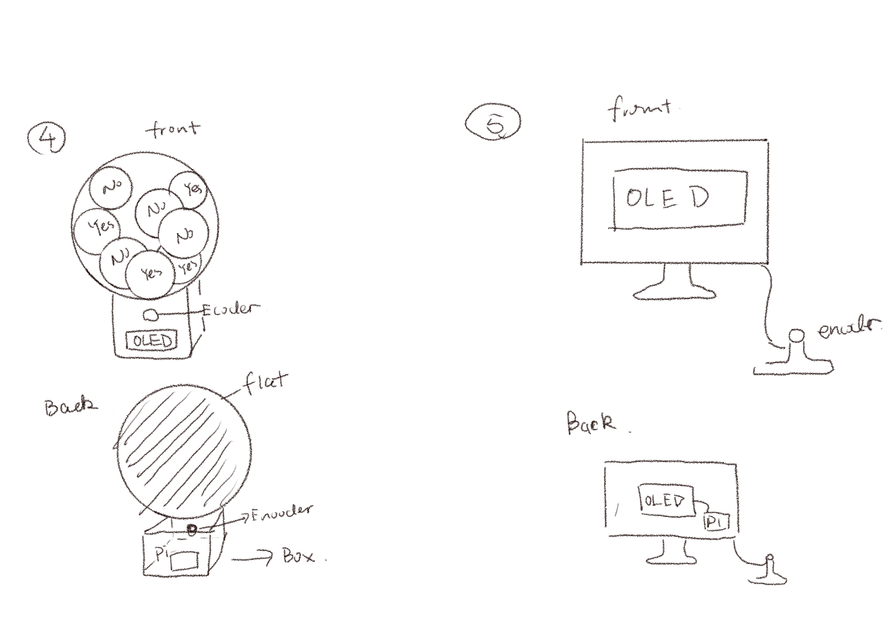

1. Fortune Teller Console — Standing Oracle Panel

Description:
The device is built like a mini fortune-telling booth. The OLED display sits in the center like a crystal ball reveal window, with the rotary encoder placed below on a small paper pedestal, acting as the “activation dial.” Labels such as YES / NO / DELAY / ASK AGAIN / FATE are printed around the upper arc to reinforce the oracle metaphor. The cardboard body is upright, allowing the user to approach it like a fortune counter and “consult fate” by spinning and pressing.

2. Tilted Mirror-Style Decision Shrine

Description:
This version uses a slanted cardboard surface at around a 60-degree viewing angle, similar to a makeup mirror or tarot reading board. The OLED display is mounted at the top of the slanted plane, making it easy to read without leaning forward. The rotary encoder is placed below it, positioned where the user’s hand naturally rests, giving a ritual-like gesture of “placing your hand to decide.” Optional LED marker graphics can be drawn around the edges to mimic a ceremonial circuit.

3. Radio Console Version — Decision Frequency Tuner

Description:
Inspired by vintage radios, this layout places the OLED screen directly in the center as a “decision frequency display.” The rotary encoder is positioned on the right side, similar to traditional tuning knobs. The left side of the panel may include printed fake speaker grills or decorative lines to reinforce the radio aesthetic. The user rotates the dial as if tuning between life choices, with the OLED updating the “station” (YES / NO / LATER), then presses to “lock the channel.”

4. Gacha / Capsule Machine Version

Description:
This version mimics a gacha toy dispenser. The top part of the cardboard shows a large drawn circular capsule chamber for visual drama. The actual interaction happens below: the OLED sits in a rectangular window like a “capsule slot,” and the rotary encoder functions as the classic twist handle. Once the user rotates the encoder to a fate state, pressing it simulates the action of releasing a capsule—visually and conceptually turning hesitation into a ritualized draw.

5. Monitor & Mouse Metaphor — Fate Terminal Interface

Description:
This version stylizes the interface like a quirky desktop computer. The OLED acts as a “mini monitor” placed at the top of a flat display panel. The rotary encoder is placed lower down and slightly forward, intentionally mimicking a computer mouse or trackball input device. The user “navigates” between decisions by rotating, with pressing acting as a left-click confirmation. The metaphor reframes indecision as a GUI interaction, giving it a humorous productivity-software twist.

**\*\*\*What are some things these sketches raise as questions? What do you need to physically prototype to understand how to anwer those questions?\*\*\***

Is the OLED screen clearly readable from the user’s natural viewing angle?
→ Physical mockups are needed to test screen height, tilt angle, and distance relative to the rotary encoder.

Does the placement of the rotary encoder match the expected hand movement metaphor?
→ For designs like the radio console or gacha machine, we need to check if users instinctively rotate the encoder in the intended way (horizontal twist vs. downward pull gesture).

Do visual elements (labels, illustrations, fake hardware graphics) successfully communicate interaction states without explanation?
→ A cardboard faceplate with drawn elements will help determine whether the YES / NO / DELAY / ASK AGAIN zones are legible and whether users understand that press = confirm / fate reveal.

How much decoration is “fun and thematic” versus distracting from the core interaction?
→ A quick paper facade test will help balance visual style vs. clarity of input/output feedback.

Can the Raspberry Pi and OLED be easily removed and reinserted during testing without damaging the cardboard frame?
→ We need to prototype a sliding or removable back panel to validate maintenance access.

**\*\*\*Pick one of these display designs to integrate into your prototype.\*\*\***

I chose to proceed with the Gacha Machine-style display housing for the prototype. This form factor strongly reinforces the playful nature of the Decision Roulette concept—rotating the encoder feels like twisting a capsule machine handle, and the OLED positioned like a capsule output window creates a clear, engaging metaphor for “locking in fate.” It also allows for a clean front-facing cardboard panel with a flat surface for labels and cutouts, while leaving enough interior space to hide the Pi and wiring.

**\*\*\*Explain the rationale for the design.\*\*\*** (e.g. Does it need to be a certain size or form or need to be able to be seen from a certain distance?)


## 🎲 Display & Housing Rationale — Fate Gacha Machine

I chose a **Gacha/Capsule Machine style housing** because it visually and culturally reinforces the idea of *decision as fate/luck*, instead of a purely functional UI. The physical form supports **dramatic interaction**, encouraging the user to “commit” to the decision like drawing a capsule from a toy machine.

### Why this shape and size?

- **Front-facing arcade/gacha-like panel** makes the interaction visible to an audience, which is ideal for performative testing and demo recording.
- The **OLED screen is positioned at eye height** when the device sits on a desk, making it readable without leaning forward.
- The **Rotary Encoder is placed in the traditional gacha-twist position** (center-lower area), creating a direct metaphor between turning the knob and twisting a capsule handle.
- The **flat vertical cardboard faceplate** allows for large, high-contrast labels such as *YES / NO / DELAY / ASK AGAIN*, which makes the decision states easy to interpret from a distance (>1 meter).
- The cardboard structure also allows the **Pi and wires to be hidden behind the front facade**, but still accessible through a removable back panel for development.

### Rotary Encoder Interaction Logic for Fate Gacha Machine

| Interaction          | Meaning / Narrative Interpretation                          | OLED Feedback Example                                         |
|---------------------|-------------------------------------------------------------|--------------------------------------------------------------|
| Rotate Clockwise     | Increasing urge / leaning towards YES / impulsive action   | `"Spinning... Fate leaning toward YES"`                      |
| Rotate Counterclockwise | Pulling back / hesitation / logical resistance              | `"Doubt rising... State moving toward NO"`                   |
| Press to Confirm     | Final fate trigger (like releasing the capsule)            | `"Capsule Released... Stand by for Result"`                  |
| (Optional) Over-Rotate | Enters chaotic/self-sabotage state                         | `"⚠ Excessive twisting detected — CHAOS MODE ENGAGED"`       |

This interaction metaphor transforms a simple knob into a **mini theatre of decision-making**, where the **rotation becomes the “thinking” phase** and **the press becomes the “act of accepting fate.”**

### Designed as a Prop for Ritual Interaction

This device is intentionally designed not just as a tool, but as a **performative prop**.  
- The exaggerated gacha-machine visuals invite dramatic interaction.
- The user is expected to **hover their hand, spin slowly, hesitate, and then press with commitment**, creating **observable emotional tension**.
- This aligns with the idea that **designing interactive objects is not only about input/output, but about staging human behavior**.


**\*\*\*Document your rough prototype.\*\*\***

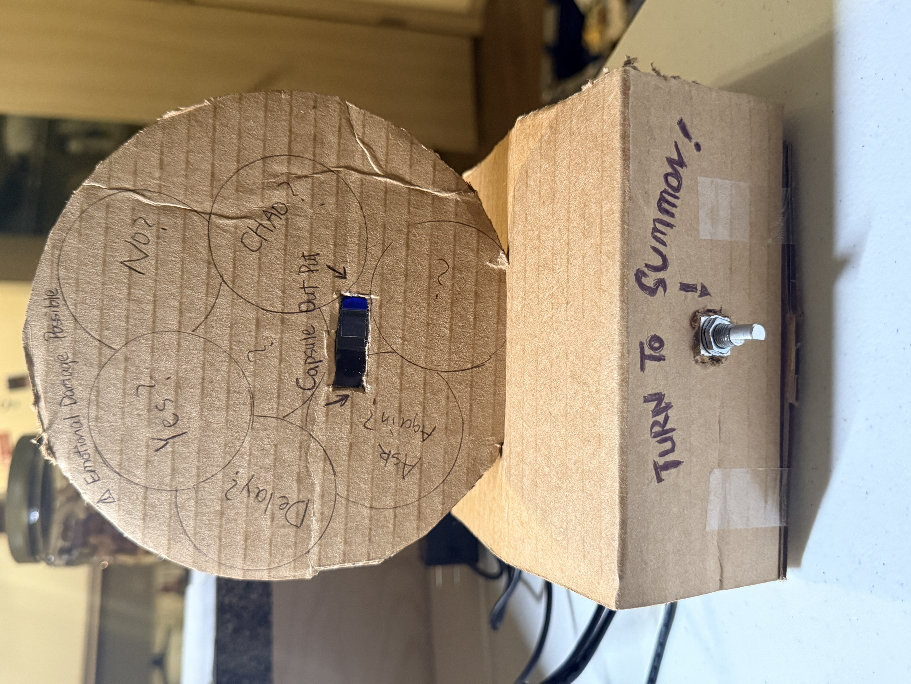
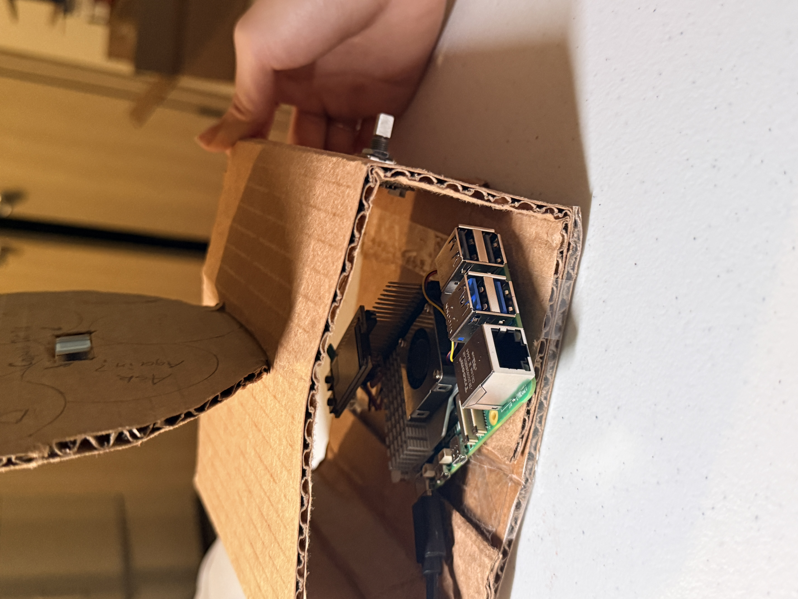

---

# LAB PART 2

### Part 2

Following exploration and reflection from Part 1, complete the "looks like," "works like" and "acts like" prototypes for your design, reiterated below.


### Part E

<details>
	<summary><strong>(Click to Expand)</strong></summary>
	
#### Chaining Devices and Exploring Interaction Effects

For Part 2, you will design and build a fun interactive prototype using multiple inputs and outputs. This means chaining Qwiic and STEMMA QT devices (e.g., buttons, encoders, sensors, servos, displays) and/or combining with traditional breadboard prototyping (e.g., LEDs, buzzers, etc.).

**Your prototype should:**
- Combine at least two different types of input and output devices, inspired by your physical considerations from Part 1.
- Be playful, creative, and demonstrate multi-input/multi-output interaction.

**Document your system with:**
- Code for your multi-device demo
- Photos and/or video of the working prototype in action
- A simple interaction diagram or sketch showing how inputs and outputs are connected and interact
- Written reflection: What did you learn about multi-input/multi-output interaction? What was fun, surprising, or challenging?

</details>

### 🎮 Interaction Reflections (Part E — Multi-Device Insights)


#### 1. What new types of interaction become possible when you combine multiple sensors and staged audio output?

In this prototype, I combine a **rotary encoder (tension input)**, a **Qwiic button (fate commit trigger)**, and **multi-layered audio + OLED prophecy display** as ritual feedback.  
Instead of a typical “input → output” interaction, the system now behaves like a **fortune mechanism with emotional staging**:

- **Encoder rotation** gradually builds "fate energy", simulating hesitation, resistance, or chaotic impulse.
- **Button press** acts as a **decisive ritual trigger**, which **first plays a mechanical `button-2.wav`**, signaling that the fate is now locked in.
- Then, a **fate audio tone** plays (`yes.wav`, `no.wav`, `delay.wav`, or `chaos.wav`), using pitch and rhythm to emotionally preload the result.
- After a **0.3 second ritual pause**, a **witch/oracle-style voice** delivers the final prophecy:
  - ✅ `yes_voice.wav` — *"Destiny aligns... YES."*
  - ✅ `no_voice.wav` — *"The threads of fate say... NO."*
  - ✅ `delay_voice.wav` — *"The future is clouded... Ask again."*
  - ✅ `chaos_voice.wav` — *"CHAOS stirs... Fate spirals beyond control."*
- The **OLED display** simultaneously reveals the textual fate outcome, reinforcing the ritual act.

This layered combination transforms a simple electronic circuit into a **narrative-driven fate negotiation ritual**.

---

#### 2. How does the physical arrangement of the ritual interface change the user experience?

The **encoder is positioned like a gacha wheel**, encouraging a dramatic twisting gesture that feels like "charging fate".  
The **button is physically separated**, so pressing it feels like **a point of no return**.

The **speaker hidden inside the enclosure** makes the audio feel like it comes from the “spirit of the machine,” while the **OLED placed at eye level** acts as a **prophecy reveal panel**.

The physical arrangement silently communicates the ritual order:

> **Turn → Accumulate tension → Commit → Audio omen → Voice prophecy**

---

#### 3. What happens when one device modulates another with staged feedback?

Rather than simply triggering output, the **encoder influences the emotional intensity of the final result**:

| Encoder Tension Level | Audio Feedback Before Prophecy |
|----------------------|--------------------------------|
| Gentle rotation       | Calm or hesitant tone (`delay.wav`) |
| Strong rotation       | Sharp or confident tone (`yes.wav` / `no.wav`) |
| Excessive twist       | **CHAOS trigger → glitch/unstable sweep tone** (`chaos.wav`) |

Only **after** the button is pressed does the **ceremony complete**: `click → fate tone → pause → prophecy voice`.

The audio pipeline itself becomes part of the user experience — **not just feedback, but ritual escalation**.

---

#### 4. How does swapping input hierarchy change the emotional pacing?

| Role Hierarchy | Experience |
|----------------|-----------|
| **Encoder primary, Button secondary** | Feels like **deliberate fate shaping** — the user stirs destiny before committing. |
| **Button primary, Encoder secondary** | Interaction becomes **instant and game-like**, with no emotional buildup. |

By **letting the encoder control anticipation and the button control irreversible commitment**, the system achieves a **cinematic pacing**: tension → silence → reveal.

This demonstrates that **sensor hierarchy + staged audio feedback = emotional interface design, not just digital I/O.**


### **CODE CAN BE FIND HERE`Lab 4/FateGachaMachine.py`**


### Diagram & Photos of Final Prototype

**Diagram:**

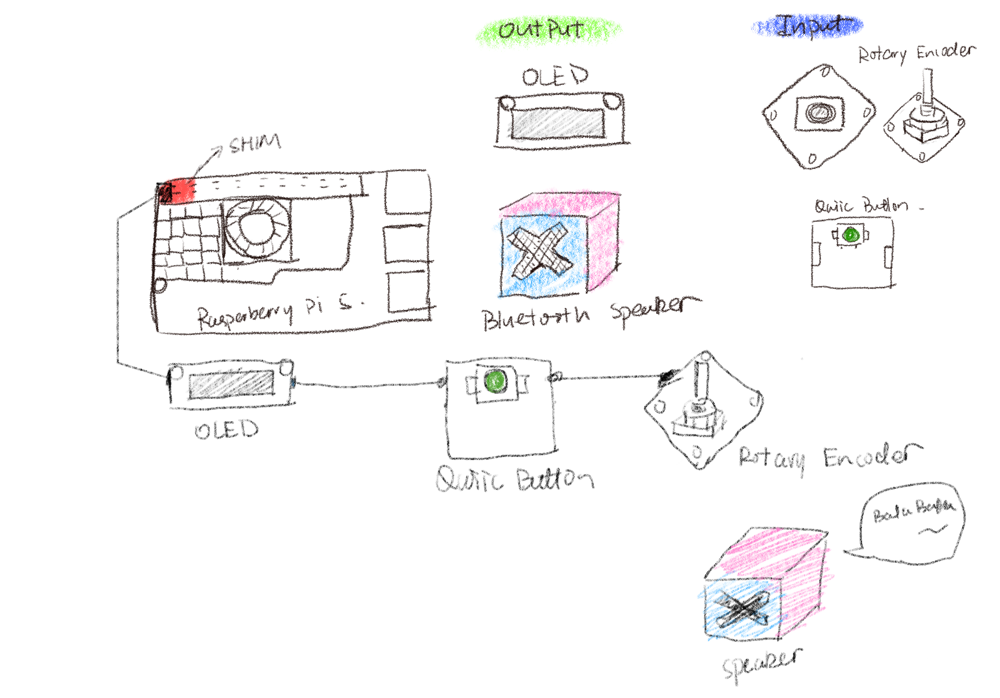

**Front:**

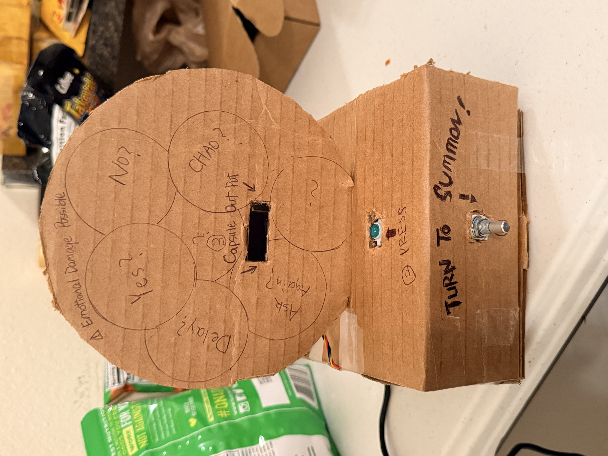

> In the final version, I add a green Qwiic button at front as a fate commit trigger
> Only the **ritual controls** (Encoder knob + Fate Button + OLED prophecy window + speaker voice) are visible.  

**Back:**

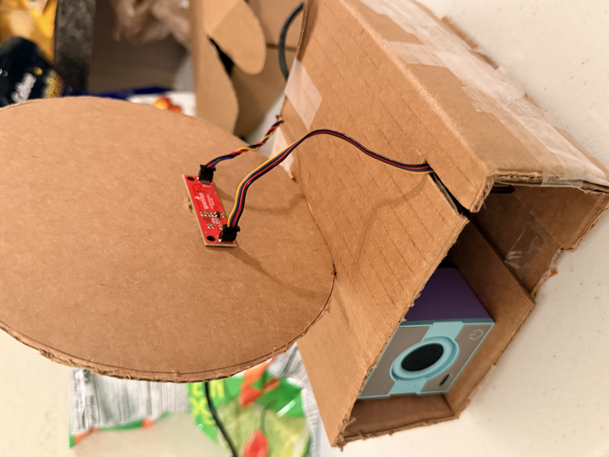

> The **Qwiic I²C cable chain (Button → Encoder → OLED)** is deliberately **routed to the back of the prototype enclosure**.  The cables are **hidden from the user's direct view** to maintain a **clean ritual interface**, where the interaction feels more like **a mystical artifact** rather than an exposed electronics rig.


**Inside:**

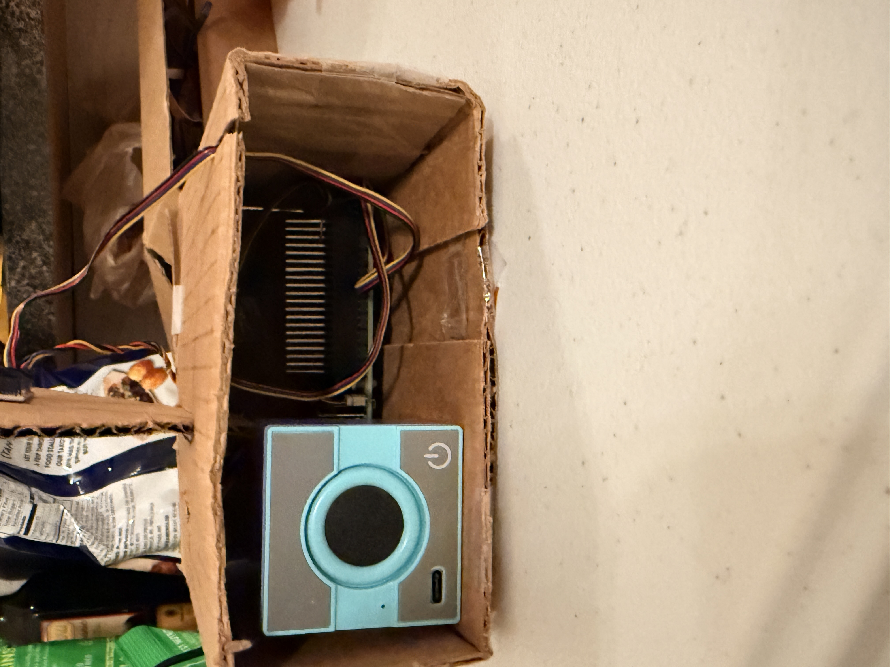

> Speaker, Pi are hidden inside the box

### 🎥 Fate Gacha Machine — Demo Videos

[](https://youtu.be/36wllkjDB4g?si=HVJIDhQuBDR3uNR7)
> **Demo 1 Works like —  working prototype in action**


[](https://youtube.com/shorts/M4OqC6_lt3M?si=1rF6T5CcuOSRnALu)
> **Demo 2 Acts like - Interact with User**

> In this first demo, I intentionally perform the ritual myself as both **designer and user**.  
> I ask the machine: **“Will I get a good grade in this class?”**  
> Knowing how the system works, I **intentionally rotate the encoder in a confident, steady direction**, increasing the probability of a **YES** outcome.  
> The machine responds accordingly — **ritual confirmed, fate aligned**.

[](https://youtube.com/shorts/enwQGLCpCDs?si=zb-HEkym95LMAnIT)
> **Demo 3 More Interaction — Chaos Mode Activation**

> In this session, I invited a friend who **had no knowledge of the fate logic** behind the machine.  
> He first asked: **“Will I have the chance to go to China this year?”**  
> Without understanding the tension mechanic, he made **random chaotic rotations**, causing the system to respond with **DELAY — Ask Again**.  
> He asked a second time, spun even more chaotically, and **triggered CHAOS mode**, followed by the oracle voice:  
> **“CHAOS stirs... Fate spirals beyond control.”**  
> → This moment revealed how the machine **creates emotional stakes even without traditional UI**, purely through physical input and staged audio feedback.

#### 🎤 Playtester Feedback

 ✅ What worked well
 
- The clean facade helps the object feel like a finished artifact, not a prototype, which increases user buy-in.
-  YES/NO/DELAY/CHAOS are perceptually distinct in both sound and copy, reducing ambiguity about what happened.
- DELAY and CHAOS encourage users to try again, revealing different behaviors and deepening engagement.

🔧 Opportunities to improve
- For naive users, chaotic spinning often yields CHAOS; consider smoothing or weighting so moderate turns feel more “discoverable” and less punitive.
- When users ask the same question twice in a row, consider a distinct “acknowledged repeat” behavior to signal system memory (even if simulated).
- Instead of using LEDs as indicators, they could be used as **emotional glow** e.g., a faint pulsing light during tension build-up, a flash for CHAOS, or a soft fade-out after prophecy delivery.


### 🔍 Written Reflection — What I Learned from Multi-Input / Multi-Output Interaction

Designing this fate machine taught me that once you combine multiple inputs and multiple expressive outputs, an interface can start to feel less like a tool and more like a ritual object.

The rotary encoder introduced something I didn’t expect at first: it created tension before the decision. Simply turning a knob shouldn’t feel emotional, but once the twist action started affecting fate probability, it transformed into a sort of "fate charging" gesture. Meanwhile, the button gained a new meaning and it was no longer just a digital trigger, but a commitment point, a moment of “no turning back.”

What surprised me the most was observing someone else using it. When I tested it myself, I already knew how to “manipulate destiny” by rotating the encoder deliberately to pull a YES result. But when I handed it to a friend who had no idea how the tension worked, he spun the encoder chaotically, laughed at the "DELAY" result, tried again with even more chaos, and triggered CHAOS mode. That moment revealed something important: multi-input systems allow players to project emotion into the interface, even if they don’t fully understand the logic underneath.

The most challenging part was not the wiring or code, it was figuring out how to pace the outputs so they feel like a psychological sequence instead of raw signals. Multi-output interaction isn’t just about “show this + play that.” It’s about **designing an emotional arc through sound, text, and timing.

In short, I learned that multi-input/multi-output interaction is not just a technical configuration but it is a narrative system.  When inputs shape anticipation, and outputs are staged like theater cues, even a small circuit can feel like it has personality, mood, and ritual power.


<details>
	<summary><strong>(Click to Expand)</strong></summary>


#### Using Multiple Qwiic Buttons: Changing I2C Address (Physically & Digitally)

If you want to use more than one Qwiic Button in your project, you must give each button a unique I2C address. There are two ways to do this:

##### 1. Physically: Soldering Address Jumpers

On the back of the Qwiic Button, you'll find four solder jumpers labeled A0, A1, A2, and A3. By bridging these with solder, you change the I2C address. Only one button on the chain can use the default address (0x6F).

**Address Table:**

| A3 | A2 | A1 | A0 | Address (hex) |
|----|----|----|----|---------------|
|  0 |  0 |  0 |  0 |    0x6F       |
|  0 |  0 |  0 |  1 |    0x6E       |
|  0 |  0 |  1 |  0 |    0x6D       |
|  0 |  0 |  1 |  1 |    0x6C       |
|  0 |  1 |  0 |  0 |    0x6B       |
|  0 |  1 |  0 |  1 |    0x6A       |
|  0 |  1 |  1 |  0 |    0x69       |
|  0 |  1 |  1 |  1 |    0x68       |
|  1 |  0 |  0 |  0 |    0x67       |
| ...| ...| ...| ... |     ...      |

For example, if you solder A0 closed (leave A1, A2, A3 open), the address becomes 0x6E.

**Soldering Tips:**
- Use a small amount of solder to bridge the pads for the jumper you want to close.
- Only one jumper needs to be closed for each address change (see table above).
- Power cycle the button after changing the jumper.

##### 2. Digitally: Using Software to Change Address

You can also change the address in software (temporarily or permanently) using the example script `qwiic_button_ex6_changeI2CAddress.py` in the Lab 4 folder. This is useful if you want to reassign addresses without soldering.

Run the script and follow the prompts:
```bash
python qwiic_button_ex6_changeI2CAddress.py
```
Enter the new address (e.g., 5B for 0x5B) when prompted. Power cycle the button after changing the address.

**Note:** The software method is less foolproof and you need to make sure to keep track of which button has which address!


##### Using Multiple Buttons in Code

After setting unique addresses, you can use multiple buttons in your script. See these example scripts in the Lab 4 folder:

- **`qwiic_1_button.py`**: Basic example for reading a single Qwiic Button (default address 0x6F). Run with:
	```bash
	python qwiic_1_button.py
	```

- **`qwiic_button_led_demo.py`**: Demonstrates using two Qwiic Buttons at different addresses (e.g., 0x6F and 0x6E) and controlling their LEDs. Button 1 toggles its own LED; Button 2 toggles both LEDs. Run with:
	```bash
	python qwiic_button_led_demo.py
	```

Here is a minimal code example for two buttons:
```python
import qwiic_button

# Default button (0x6F)
button1 = qwiic_button.QwiicButton()
# Button with A0 soldered (0x6E)
button2 = qwiic_button.QwiicButton(0x6E)

button1.begin()
button2.begin()

while True:
		if button1.is_button_pressed():
				print("Button 1 pressed!")
		if button2.is_button_pressed():
				print("Button 2 pressed!")
```

For more details, see the [Qwiic Button Hookup Guide](https://learn.sparkfun.com/tutorials/qwiic-button-hookup-guide/all#i2c-address).

---

### PCF8574 GPIO Expander: Add More Pins Over I²C

Sometimes your Pi’s header GPIO pins are already full (e.g., with a display or HAT). That’s where an I²C GPIO expander comes in handy.

We use the Adafruit PCF8574 I²C GPIO Expander, which gives you 8 extra digital pins over I²C. It’s a great way to prototype with LEDs, buttons, or other components on the breadboard without worrying about pin conflicts—similar to how Arduino users often expand their pinouts when prototyping physical interactions.

**Why is this useful?**
- You only need two wires (I²C: SDA + SCL) to unlock 8 extra GPIOs.
- It integrates smoothly with CircuitPython and Blinka.
- It allows a clean prototyping workflow when the Pi’s 40-pin header is already occupied by displays, HATs, or sensors.
- Makes breadboard setups feel more like an Arduino-style prototyping environment where it’s easy to wire up interaction elements.

**Demo Script:** `Lab 4/gpio_expander.py`

<p align="center">
    
</p>

We connected 8 LEDs (through 220 Ω resistors) to the expander and ran a little light show. The script cycles through three patterns:
- Chase (one LED at a time, left to right)
- Knight Rider (back-and-forth sweep)
- Disco (random blink chaos)

Every few runs, the script swaps to the next pattern automatically:
```bash
python gpio_expander.py
```

This is a playful way to visualize how the expander works, but the same technique applies if you wanted to prototype buttons, switches, or other interaction elements. It’s a lightweight, flexible addition to your prototyping toolkit.

---

### Servo Control with SparkFun Servo pHAT
For this lab, you will use the **SparkFun Servo pHAT** to control a micro servo (such as the Miuzei MS18 or similar 9g servo). The Servo pHAT stacks directly on top of the Adafruit Mini PiTFT (135×240) display without pin conflicts:
- The Mini PiTFT uses SPI (GPIO22, 23, 24, 25) for display and buttons ([SPI pinout](https://pinout.xyz/pinout/spi)).
- The Servo pHAT uses I²C (GPIO2 & 3) for the PCA9685 servo driver ([I2C pinout](https://pinout.xyz/pinout/i2c)).
- Since SPI and I²C are separate buses, you can use both boards together.
**⚡ Power:**
- Plug a USB-C cable into the Servo pHAT to provide enough current for the servos. The Pi itself should still be powered by its own USB-C supply. Do NOT power servos from the Pi’s 5V rail.

<p align="center">
    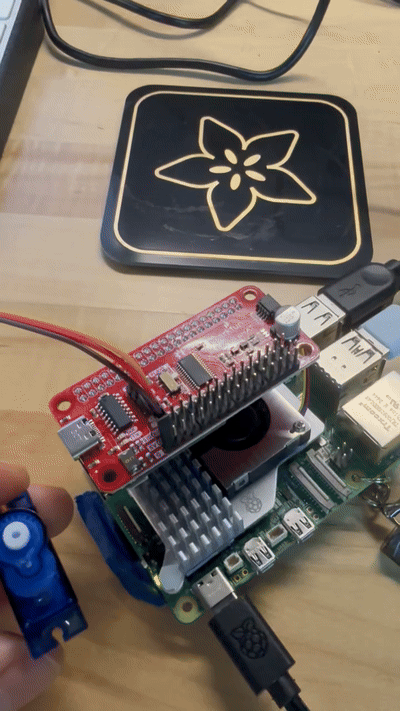
</p>

**Basic Python Example:**
We provide a simple example script: `Lab 4/pi_servo_hat_test.py` (requires the `pi_servo_hat` Python package).
Run the example:
```
python pi_servo_hat_test.py
```
For more details and advanced usage, see the [official SparkFun Servo pHAT documentation](https://learn.sparkfun.com/tutorials/pi-servo-phat-v2-hookup-guide/all#resources-and-going-further).
A servo motor is a rotary actuator that allows for precise control of angular position. The position is set by the width of an electrical pulse (PWM). You can read [this Adafruit guide](https://learn.adafruit.com/adafruit-arduino-lesson-14-servo-motors/servo-motors) to learn more about how servos work.

---


### Part F

### Record

Document all the prototypes and iterations you have designed and worked on! Again, deliverables for this lab are writings, sketches, photos, and videos that show what your prototype:
* "Looks like": shows how the device should look, feel, sit, weigh, etc.
* "Works like": shows what the device can do
* "Acts like": shows how a person would interact with the device

</details>
