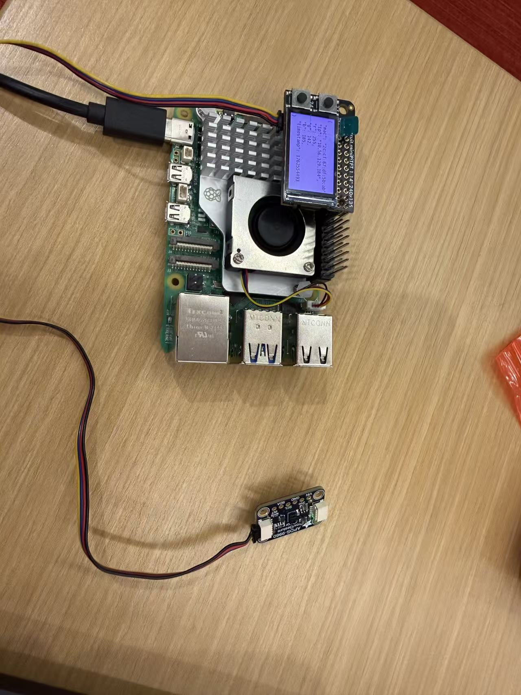
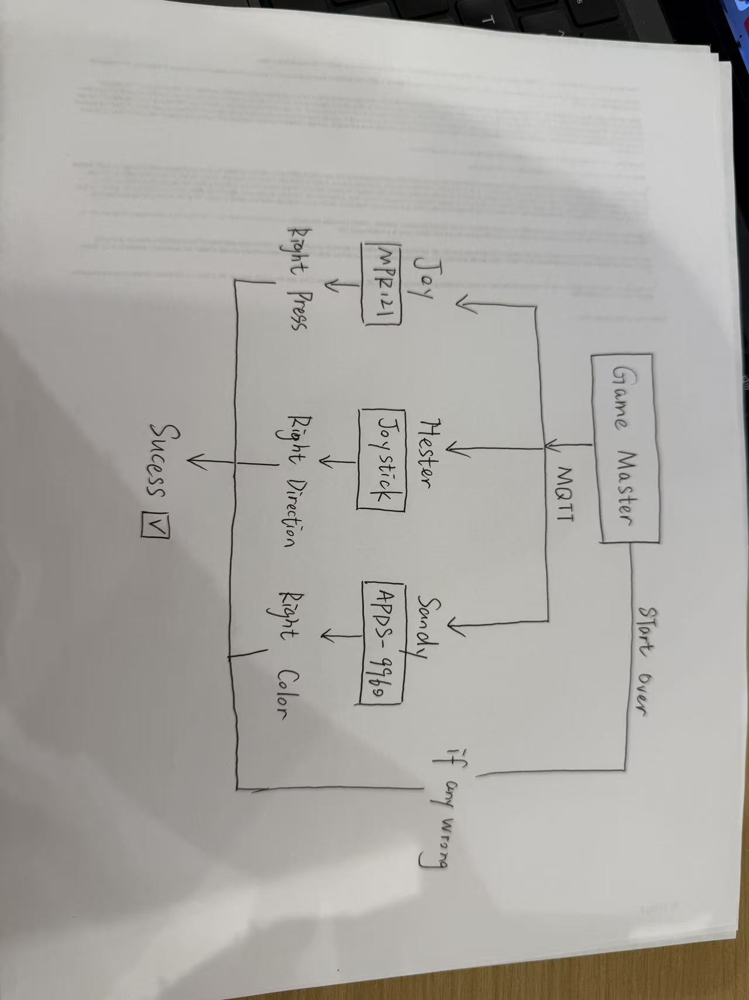
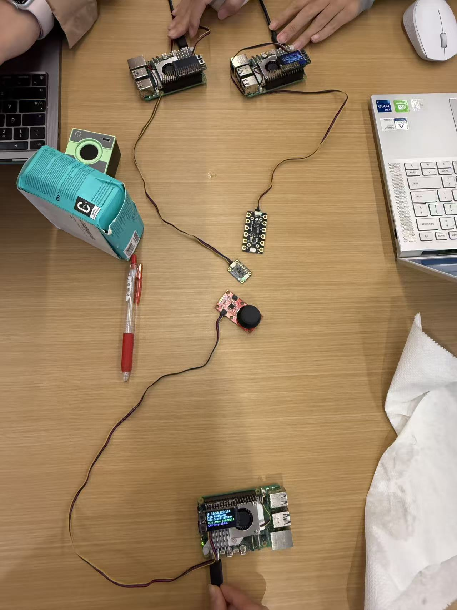
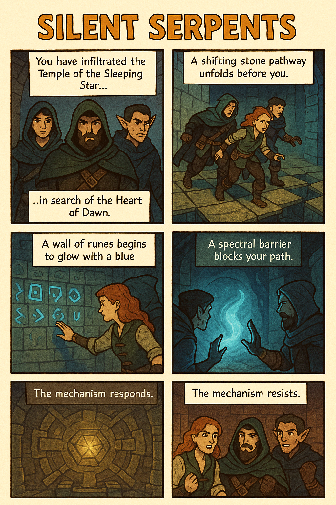

# Distributed Interaction

**Hester Li, Joy Sun, Sandy Zhan**

For submission, replace this section with your documentation!

---

<details>
	<summary><strong>(Click to Expand)</strong></summary>

## Prep

1. Pull the new changes
2. Read: [The Presence Table](https://dl.acm.org/doi/10.1145/1935701.1935800) ([video](https://vimeo.com/15932020))

## Overview

Build interactive systems where **multiple devices communicate over a network** using MQTT messaging. Work in teams of 3+ with Raspberry Pis.

**Parts:**
- A: Learn MQTT messaging
- B: Try collaborative pixel grid demo  
- C: Build your own distributed system

</details>


---

## Part A: MQTT Messaging

<details>
	<summary><strong>(Click to Expand)</strong></summary>
 
MQTT = lightweight messaging for IoT. Publish/subscribe model with central broker.

**Concepts:**
- **Broker**: `farlab.infosci.cornell.edu:1883`
- **Topic**: Like `IDD/bedroom/temperature` (use `#` wildcard)
- **Publish/Subscribe**: Send and receive messages

**Install MQTT tools on your Pi:**
```bash
sudo apt-get update
sudo apt-get install -y mosquitto-clients
```

**Test it:**

**Subscribe to messages (listener):**
```bash
mosquitto_sub -h farlab.infosci.cornell.edu -p 1883 -t 'IDD/#' -u idd -P 'device@theFarm'
```

**Publish a message (sender):**
```bash
mosquitto_pub -h farlab.infosci.cornell.edu -p 1883 -t 'IDD/test/yourname' -m 'Hello!' -u idd -P 'device@theFarm'
```

> **💡 Tips:**
> - Replace `yourname` with your actual name in the topic
> - Use single quotes around the password: `'device@theFarm'`

**🔧 Debug Tool:** View all MQTT messages in real-time at `http://farlab.infosci.cornell.edu:5001`


</details>


#### 💡 Brainstorm — 5 Ideas for Messaging Between Devices

##### 1. Mood Lights Across Rooms
**Concept:** Each Raspberry Pi controls an RGB LED strip that reflects the user’s mood.  
**Mechanism:**  
- A Pi with a color sensor or slider publishes to `IDD/mood/hester → {r,g,b}`.  
- Other Pis subscribe to `IDD/mood/#` and blend incoming colors (average RGB).  
**Effect:** Everyone’s lights softly synchronize — if one sets blue (calm), all rooms drift cooler.  
**Learning focus:** Continuous data messaging, aggregation logic, visual feedback.

---

##### 2. Presence Ping-Pong
**Concept:** A playful “I’m here” or “poke” system between teammates.  
**Mechanism:**  
- Pressing a Pi button publishes `IDD/ping/name`.  
- The recipient Pi flashes an LED or plays a tone, then auto-replies `pong`.  
**Effect:** Low-latency emotional connection loop.  
**Learning focus:** Topic-based targeting, timing, and event acknowledgment.

---

##### 3. Collaborative Counter / Shared Scoreboard
**Concept:** Each device has a button that increases or decreases a shared counter.  
**Mechanism:**  
- Publish increments to `IDD/counter/increment` or `IDD/counter/decrement`.  
- All subscribers maintain and display the global total.  
**Effect:** Live distributed tally for votes, focus tracking, or group progress.  
**Learning focus:** State synchronization and conflict resolution across devices.

---

##### 4. Sound Ripple Network
**Concept:** One device plays a tone; others echo or harmonize in sequence.  
**Mechanism:**  
- A Pi detects sound amplitude or button press → publishes `IDD/sound/note:C4`.  
- Other Pis subscribe and trigger tones with slight delay (+200 ms each).  
**Effect:** A cascading “musical wave.”  
**Learning focus:** Timestamp-based scheduling, ordering of messages, coordinated timing.

---

##### 5. Distributed Weather Display
**Concept:** Each device shares local sensor readings (temperature, humidity, or light).  
**Mechanism:**  
- Each Pi publishes `IDD/weather/piName → {temp, humidity}`.  
- A dashboard Pi aggregates and visualizes all nodes’ data.  
**Effect:** A small IoT network sensing micro-environments across a space.  
**Learning focus:** Data collection, JSON message structure, and visualization.

---


## Part B: Collaborative Pixel Grid

<details>
	<summary><strong>(Click to Expand)</strong></summary>
 
Each Pi = one pixel, controlled by RGB sensor, displayed in real-time grid.

**Architecture:** `Pi (sensor) → MQTT → Server → Web Browser`

**Setup:**

1. **Sensor**

#### Light/Proximity/Gesture sensor (APDS-9960)
We use this sensor [Adafruit APDS-9960](https://www.adafruit.com/product/3595) for this exmaple to detect light (also RGB)
 


Connect it to your pi with Qwiic connector


We need to use the screen to display the color detection, so we need to stop the running piscreen.service to make your screen available again

```bash
# stop the screen service
sudo systemctl stop piscreen.service
```

if you want to restart the screen service
```bash
# start the screen service
sudo systemctl start piscreen.service
```
 
2. **Server** (one person on laptop):
```bash
cd "Lab 6"  
source .venv/bin/activate
pip install -r requirements-server.txt
python app.py
```

2. **View in browser:**
   - Grid: `http://farlab.infosci.cornell.edu:5000`
   - Controller: `http://farlab.infosci.cornell.edu:5000/controller`

3. **Pi publisher** (everyone on their Pi):
```bash
# First time setup - create virtual environment
cd "Lab 6"
python -m venv .venv
source .venv/bin/activate
pip install -r requirements-pi.txt

# Run the publisher
python pixel_grid_publisher.py
```

Hold colored objects near sensor to change your pixel!


</details>

**📸 Include: Screenshot of grid + photo of your Pi setup**

[](https://youtu.be/6vmiTTxWM5w)
*Demo 1 – grid color changes.*

Pi setup:




We successfully visualized real-time color detection from multiple devices.
The hardest part was coordinating MQTT topics and maintaining connection stability.
This exercise helped us understand distributed interaction between hardware systems.

---

## Part C: Make Your Own


[](https://youtu.be/HpCUQ5m_lUI)

*Demo 2 – Successful mechanism activation & treasure reveal.*

[](https://youtu.be/X49TW9GbIAs?si=_uI-3xRdj2L-BlTg)

*Demo 3 – Test with ourself.*

---

### **1. Project Description**
This is a cooperative game in which three players attempt to retrieve a legendary treasure hidden deep inside an ancient temple. Each player controls a different physical sensor device. The Game Master script delivers the story narration and instructions over MQTT. Players must perform their assigned actions in the correct order to advance the story.

The interaction becomes meaningful because:

- Each player contributes a unique action.
- No player can solve the puzzle alone.
- Success depends on communication and timing.

The story framework turns simple sensor actions into dramatic “temple mechanisms” that must be activated to progress.


### **2. Architecture Diagram**  

Three Raspberry Pis act as players:

- Player A（Joy Sun） uses a touch sensor
- Player B (Hester Li)uses a joystick
- Player C(Sandy Zhan) uses a color sensor

A central Game Master coordinates the game:

1. Sends narration text to all players.
2. Sends individual tasks privately to each player.
3. Waits for each player to respond with either “success” or “fail.”
4. Determines whether the group continues or the adventure ends.



---

### **3. Build Documentation**  

#### - **Hardware Setup**  

Each Raspberry Pi is connected to:

- Power
- I2C communication lines for its sensor

Player A interacts by touching specific pads.
Player B interacts by moving or pressing the joystick.
Player C interacts by showing colored objects to the APDS-9960.

Each sensor continuously reads input and checks whether the required action has been performed.




---

#### - **MQTT Communication Structure**

All the code is stored in: [🧩 View Lab 6 Code Folder →](./Lab6%20Code)

**Server files:**
- `app.py` - Pixel grid server (Flask + WebSocket + MQTT)
- `mqtt_viewer.py` - MQTT message viewer for debugging
- `mqtt_bridge.py` - MQTT → WebSocket bridge
- `requirements-server.txt` - Server dependencies

**Pi files:**
- `pixel_grid_publisher.py` - Example (RGB sensor → MQTT)
- `requirements-pi.txt` - Pi dependencies

**Web interface:**
- `templates/grid.html` - Pixel grid display
- `templates/controller.html` - Color picker
- `templates/mqtt_viewer.html` - Message viewer
</details>

- [`game_master.py`](./Lab6/code/game_master.py) | Central controller that sends narration, assigns tasks, and evaluates results via MQTT.
- [`Joy_Client.py`](./Lab6/code/Joy_Client.py) | Player A’s client code (Touch sensor).
- [`Hester_Client.py`](./Lab6/code/Hester_Client.py) | Player B’s client code (Joystick control).
- [`Sandy_Client.py`](./Lab6/code/Sandy_Cilent.py) | Player C’s client code (Color sensor).

---

The Game Master sends story narration using the topic:
game/story

The Game Master sends individual task commands:
game/<player_name>/task


Each player reports success or failure to:
game/<player_name>/result


The Game Master broadcasts final outcome:
game/status


Payload: game_success or game_fail
Broker:
Host: farlab.infosci.cornell.edu
Port: 1883
Username: idd
Password: device@theFarm

---

#### - 4.Story Introduction

You are part of a legendary trio of master thieves, known across kingdoms as the Silent Serpents.
Tonight, you infiltrate the ancient Temple of the Sleeping Star, a place rumored to guard the priceless relic known as the Heart of Dawn.

The temple is protected by layered traps, intricate puzzles, and arcane barriers.
Only perfect coordination will allow you to survive… and escape with the treasure.



##### - Challenge 1 — The Shifting Pathway

A long stone pathway stretches before you.
The floor panels slide and realign like living machinery, revealing hidden spike pits beneath.

To move forward safely, your steps must be chosen with precision.
The temple waits for your command.

##### - Challenge 2 — The Runes of Awakening

A towering wall carved with ancient runes begins to glow in a cool blue light.
Each symbol corresponds to an old incantation — but only one correct combination will unlock the next chamber.

A single mistake could seal the passage forever.

##### - Challenge 3 — The Veil of Spectral Light

Ahead, a shimmering arcane barrier blocks the path.
Its surface ripples like moonlit water, changing color with an otherworldly rhythm.

Only by matching its hue precisely can the barrier be dissolved and the path revealed.

##### - Outcomes

**If the action is correct:**
Your movement is precise. The mechanism responds. The path forward opens.

**If the action fails:**
Your action falters. The mechanism resists. The temple remains sealed, and time is running out.


#### 5. 🧪 User Testing Summary

The videos above show the final successful user test sessions of *Silent Serpents*.  
Each player group went through around **five trial attempts** before completing the sequence smoothly.Most participants were curious but unsure how the different sensors would interact. They expected the game to be simple and linear.

Although the core mechanics are simple—direction control, rune activation, and color matching—the gameplay still required **precise coordination and timing** between participants.  
Through multiple retries, the users learned how to communicate more efficiently and anticipate the temple’s traps together.


[](https://youtu.be/vdrnqq7rVQQ?si=gwL2ycjkJ4blA21E)

*Demo 4 – test with 3 users.*

###### 💬 User Feedback & Insights

**User A:**  
> “It felt really tense at first because every move could trigger something unexpected.  
> Once we figured out the rhythm, it became fun and satisfying.  
> Maybe add a short visual cue before the spikes appear—it would help new players adjust faster.”

**User B:**  
> “I like that it’s not just reaction-based but also about teamwork.  
> We had to talk and coordinate which side to move, just like solving a puzzle under pressure.  
> It would be nice if there were sound effects or ambient music that changes with progress.”

**User C:**  
> “The color-matching barrier was my favorite—it felt magical when it opened.  
> But sometimes it was hard to tell when we succeeded.  
> Maybe add a clearer success animation or light pulse to celebrate the moment.”

###### 🧭 Key Takeaways & Imrpovement Suggestion

- Players need **several rounds of practice** before mastering the sequence.  
- **Team communication** dramatically improves success rate.  
- Adding more **sensory feedback (sound, light, motion)** could make the experience more intuitive and rewarding.

Overall, even as a simple prototype, **Silent Serpents Game** successfully encouraged collaboration, timing, and shared discovery—exactly the spirit of the legendary trio of thieves.


---

#### 🪞 Lab 6 Reflection

During Lab 6, we focused on refining the interaction logic and system response flow.  
At first, it took several rounds of debugging before the sensors and outputs worked in sync —  
small timing delays or signal mismatches often caused unexpected results.  
After multiple iterations, I learned how important it is to test each component separately  
before combining them into a complete interactive system.

This lab also reminded me how *design* and *engineering* thinking intersect:  
we weren’t just writing code, but shaping a responsive behavior that feels natural to users.  
The moment when everything finally aligned — sensors, visuals, and feedback — was genuinely satisfying.  
If I continue developing this prototype, I’d like to add more layered feedback (sound + light)  
and make the interaction more expressive under different user inputs.

---

**Silent Serpents**, was built collaboratively by three team members, each responsible for a different hardware client and part of the interaction system.

- **Hester (Player B)** – Implemented the **joystick control system** and coordinated overall device integration.  
  Responsible for designing directional input logic, MQTT communication structure, and synchronization between devices.  

- **Joy (Player A)** – Developed the **touch sensor client**, which detects user input to trigger specific in-game actions.  
  Focused on refining signal stability, optimizing response timing, and ensuring smooth communication with the central controller.

- **Sandy (Player C)** – Created the **color sensor module**, managing color detection and hue matching for the magical barrier puzzle.  
  Worked on translating sensor data into visual game feedback and contributed to calibration and visual design.

Together, the team integrated all three devices with the central **`game_master.py`** controller,  
which narrates the story, assigns player tasks, and evaluates each group’s performance through MQTT messaging.

---

<details>
	<summary><strong>(Click to Expand)</strong></summary>
 
**Requirements:**
- 3+ people, 3+ Pis
- Each Pi contributes sensor input via MQTT
- Meaningful or fun interaction

**Ideas:**

**Sensor Fortune Teller**
- Each Pi sends 0-255 from different sensor
- Server generates fortunes from combined values

**Frankenstories**
- Sensor events → story elements (not text!)
- Red = danger, gesture up = climbed, distance <10cm = suddenly

**Distributed Instrument**
- Each Pi = one musical parameter
- Only works together

**Others:** Games, presence display, mood ring

### Deliverables

Replace this README with your documentation:

**1. Project Description**
- What does it do? Why interesting? User experience?

**2. Architecture Diagram**
- Hardware, connections, data flow
- Label input/computation/output

**3. Build Documentation**
- Photos of each Pi + sensors
- MQTT topics used
- Code snippets with explanations

**4. User Testing**
- **Test with 2+ people NOT on your team**
- Photos/video of use
- What did they think before trying?
- What surprised them?
- What would they change?

**5. Reflection**
- What worked well?
- Challenges with distributed interaction?
- How did sensor events work?
- What would you improve?

---

## Code Files

**Server files:**
- `app.py` - Pixel grid server (Flask + WebSocket + MQTT)
- `mqtt_viewer.py` - MQTT message viewer for debugging
- `mqtt_bridge.py` - MQTT → WebSocket bridge
- `requirements-server.txt` - Server dependencies

**Pi files:**
- `pixel_grid_publisher.py` - Example (RGB sensor → MQTT)
- `requirements-pi.txt` - Pi dependencies

**Web interface:**
- `templates/grid.html` - Pixel grid display
- `templates/controller.html` - Color picker
- `templates/mqtt_viewer.html` - Message viewer

---

## Debugging Tools

**MQTT Message Viewer:** `http://farlab.infosci.cornell.edu:5001`
- See all MQTT messages in real-time
- View topics and payloads
- Helpful for debugging your own projects

**Command line:**
```bash
# See all IDD messages
mosquitto_sub -h farlab.infosci.cornell.edu -p 1883 -t "IDD/#" -u idd -P "device@theFarm"
```

---

## Troubleshooting

**MQTT:** Broker `farlab.infosci.cornell.edu:1883`, user `idd`, pass `device@theFarm`

**Sensor:** Check `i2cdetect -y 1`, APDS-9960 at `0x39`

**Grid:** Verify server running, check MQTT in console, test with web controller

**Pi venv:** Make sure to activate: `source .venv/bin/activate`


---

## Submission Checklist

Before submitting:
- [ ] Delete prep/instructions above
- [ ] Add YOUR project documentation
- [ ] Include photos/videos/diagrams  
- [ ] Document user testing with non-team members
- [ ] Add reflection on learnings
- [ ] List team names at top

**Your README = story of what YOU built!**

---

Resources: [MQTT Guide](https://www.hivemq.com/mqtt-essentials/) | [Paho Python](https://www.eclipse.org/paho/index.php?page=clients/python/docs/index.php) | [Flask-SocketIO](https://flask-socketio.readthedocs.io/)

</details>

